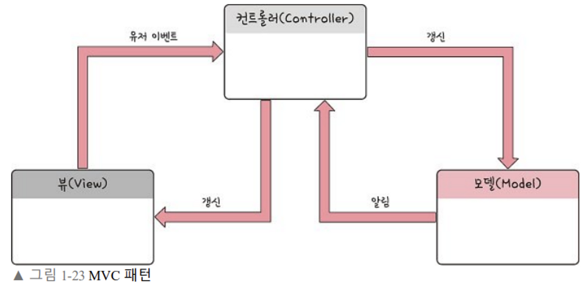

# MVC 패턴

Model, View, Controller 로 이루어진 디자인 패턴

애플리케이션의 구성 요소를 세 가지 역할로 구분해, 개발 프로세스에서 각각의 구성 요소에만 집중해서 개발할 수 있음.

- 애플리케이션을 세 가지 역할로 구분한 방법론
- Model (Model) : 데이터베이스에 데이터를 가져오거나 저장하는 로직을 처리.
- View (Template) : 모델에 담겨있는 데이터를 사용해서 화면에 출력
- Controller (View) : HTTP 요청을 받아서 파라미터를 검증하고, 비즈니스 로직을 실행한다. 그리고 뷰에 전달할 결과 데이터를 조회해서 모델에 담는다.

### 장점

- 화면단과 로직단이 분리되었기 때문에 유지보수에 용이하다. 
- 중복되는 코드를 줄여준다.
- Model, View가 다른 컴포넌트에 종속되지 않아 애플리케이션의 확장성에 유리하다.

### 단점

- 3가지 구조로 분리해야 하기 때문에, 개발 시간과 비용이 증가한다.
- Model, View 사이에 의존성이 있기 때문에, 유닛 테스트를 할 때 어려움이 있다.
- 또 3가지가 서로 의존하기 때문에, Controller에 다수의 Model 과 View 가 복잡하게 연결되어 있는 상황이 발생할 수도 있다.

### MVC 1 패턴

- View 와 Controller 를 모두 JSP 가 담당함.
- JSP 에서 유저 요청을 받고 응답을 처리함.
- 구현 난이도는 쉬우나, 프로젝트가 거대해질 수록 가독성이 떨어지고, 유지보수 하기 어려워짐
- 하나의 JSP 에서 MVC 가 모두 이루어지니, 각 기능별로 분리해주는 게 좋다.

### MVC 2 패턴

- 표준으로 사용되는 패턴, MVC 를 기능별로 분리한다.
- Model, View, Controller 가 분리.
- 역할이 분리되어 가독성이 좋고, 유지보수하기 용이하다.
- 스프링 프레임워크가 이러한 패턴으로 구현되어 있다.
