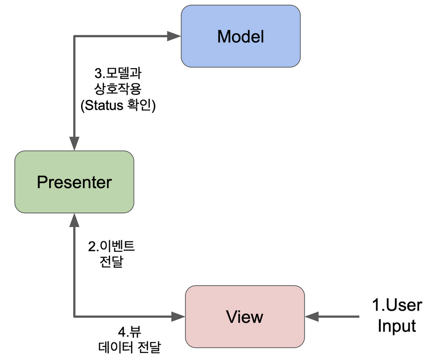

# MVP 패턴

- Model, View, Presenter 로 이루어진 패턴. Controller 이 하는 역할을 Presenter 가 대신한다고 보면 된다.

- MVC 대신 MVP 를 사용하는 이유?
- MVC 는 Model 과 View 가 서로 연결되어 있어서 의존관계를 갖는다.

MVC 패턴의 문제점

- 모델은 모델의 상태 변화가 있을 때, 컨트롤러와 뷰에 이를 통보한다.
- 뷰는 사용자가 볼 결과물을 생성하기 위해 모델로부터 정보를 얻어온다.
- View, Model 사이에는 의존성이 있음.

MVP : **View 와 Model 의 의존성이 없다!!!**

View 와 Presenter 사이를 직접 연결하는 대신 인터페이스를 통해 상호작용한다. 결합도를 낮춘다!

뷰와 뷰 인터페이스가 존재하고, 뷰 인터페이스를 통해 presenter 와 연결한다.

하지만 MVP는 Model과 View 가 분리되어 있고, 오직 Presenter 를 통해 상태나 변화를 알려준다.

View 와 비지니스 로직이 완전히 분리가 되어, 테스트하기 용이해진다는 장점이 있다.

1. 모든 입력(Input)들은 View로 전달됩니다.
2. View 는 Presenter 에게 액션이 들어왔다고 전달한다.
3. Presenter는 입력에 해당하는 Model을 업데이트 합니다.
4. Model 업데이트 결과를 기반으로 View를 업데이트 합니다.
5. Presenter는 해당 View를 참조하고 있습니다.(View와 Presenter는 1:1 관계입니다.)
6. Presenter는 View와 Model 인스턴스를 가지고, Model과 View 사이의 매개체 역할을 합니다.

- Model : 앱에서 사용되는 데이터와 그 데이터를 처리하는 부분
- View : 사용자에게 직접적으로 보여지는 UI 단
- Presenter : View 에서 요청한 정보를 토대로 Model 을 가공해서 View 를 통해 다시 사용자에게 보여지게 하는 역할을 함. Controller 와 유사하지만, View 에 직접 연결되는 대신 인터페이스를 통해 상호작용한다는 차이가 있음.

### 장점

- MVC 와 다르게 코드가 깔끔해짐
- Model 과 View 의 결합도를 낮추면, 새로운 기능 추가 및 변경을 할 때마다 관련된 부분만 코드를 수정하면 된다. 확장성 굳
- UI, Data 각각 파트를 나누어서 개발하므로, 기능이 명확해짐

### 단점

- View 와 Presenter 사이의 의존성이 강해지는 문제가 있음
- View 는 Presenter 와만 연결되어 있으므로, 의존성이 강해진다.
- 프로젝트가 거대해지면, Presenter 가 복잡해질 수 있다.

MVC 는 controller 와 view 가 1:n 관계가 존재하고, MVP 는 1:1 관계가 존재한다.

- MVC에서 컨트롤러는 사용자 인풋을 관리하며 모델에게 수행할 작업을 알려주지만, MVP에서는 뷰가 사용자 인풋을 관리하고 프리젠터와 통신하여 역할을 수행한다.
