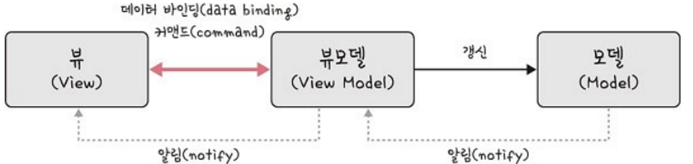

# MVVM 패턴

- MVC 의 C (Controller) 가 뷰 모델 (View model) 로 바뀐 패턴.
- ViewModel이 View 와 Model의 중간 계층 역할을 한다.

뷰모델 → 뷰를 더 추상화한 계층. 

- Model : 어플리케이션에서 사용되는 데이터를 관리하는 부분.
- View : 사용자에게 보여지는 UI 부분.
- ViewModel :애플리케이션의 핵심적인 비즈니스 로직을 처리. View 의 요청에 따라 로직을 실행하고, Model 의 변화에 따라 View 를 Refresh 한다.

Vue 는 view 와 Model 을 연결하고 자동으로 바인딩하는 양방향 통신을 가능하게 함.

MVVM 패턴은 MVC 패턴과 다르게 Command와 Data Binding을 통해 구현됨.

### 로직

1. View에 입력이 들어오면 ViewModel에게 명령을 합니다
2. ViewModel은 필요한 데이터를 Model에게 요청합니다
3. Model은 ViewModel에게 요청된 데이터를 응답합니다
4. ViewModel은 응답 받은 데이터를 가공해서 저장합니다
5. View는 ViewModel과의 Data Binding으로 인해 자동으로 갱신됩니다. 화면에 나타낸다.

### 장점

- View 와 Model 사이의 의존성이 없음. 독립적으로 개발할 수 있다.
- 독립성을 가지므로, 효율적인 유닛테스트가 가능하다.
- View 와 ViewModel 을 바인딩하므로, 코드의 양이 줄어든다.
- View 와 ViewModel 의 관계가 N:1 이다.

### 단점

- 간단한 UI에서 초기에 ViewModel을 설계할 때 어려움이 있음.
- 데이터바인딩이 필수적으로 요구됨.
- 복잡해질수록 ViewModel 이 빠르게 비대해진다.
