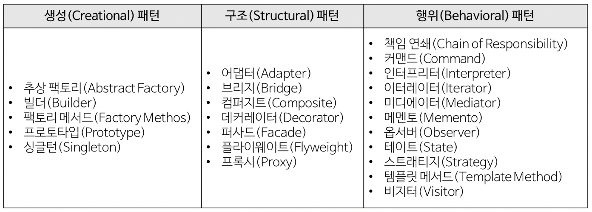

# 디자인 패턴의 이해

### **📌 디자인 패턴이란**
- 소프트웨어를 설계할때 특정 맥락에서 자주 발생하는 고질적인 문제들이 또 발생했을때 재사용할 수 있는 훌륭한 해결책
- 클래스 라이브러리 구현 시, 디자인 패턴이 적용된다.
- GoF 디자인 패턴의 종류

 

### **📎 장점**
- 개발자 간의 원활한 의사소통
- 소프트웨어 구조 파악 용이
- 재사용을 통한 개발 시간 단축
- 설계 변경 요청에 대한 유연한 대처

 

### **📎 단점**
- 객체지향 설계/구현 위주
- 초기 투자 비용 부담