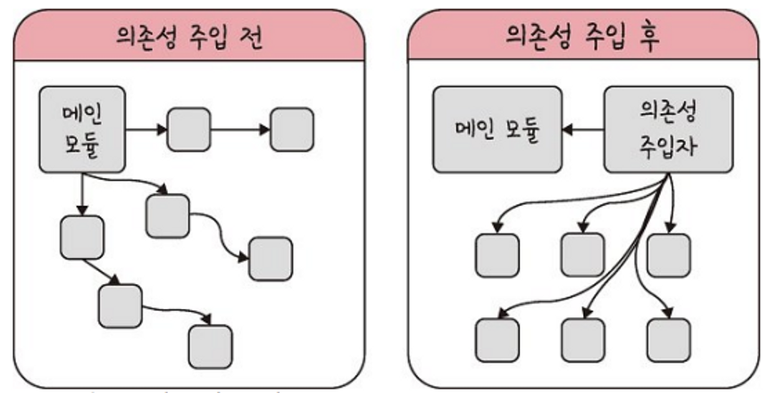

# 싱글톤 패턴

### **📌 개념**

- 객체의 인스턴스가 오직 하나의 인스턴스만 생성되는 패턴
- 전역변수를 사용하지 않고 객체를 하나 생성하도록 하며, 생성된 객체를 어디에서든지 참조할 수 있도록 하는 패턴
- 하나의 클래스에 대해 여러 인스턴스를 생성할 필요가 없고, 인스턴스를 매번 생성하는 게 부담이 된다면, 싱글톤 패턴을 사용하는게 좋다.
- 주로 **데이터베이스 연결 모듈**에 사용된다. (데이터베이스 연결 인스턴스는 하나만 있어도 충분하고, 매번 인스턴스를 생성하면 부담되니까)
- 하나의 인스턴스에만 의존하므로, 의존성이 높아진다는 단점이 있다.
- 만약 하나의 인스턴스가 너무 많은 일을 하거나, 너무 많은 데이터를 공유하게 하면, 다른 클래스 간의 결합도가 높아진다! (개방-폐쇄 원칙 위배)            

<br>

#### **OCP (개방 폐쇄 원칙)**

- 확장에는 열려 있으나, 변경에는 닫혀 있어야 한다.
- A 클래스의 인스턴스를 B 클래스에서 사용한다고 할 때, A 클래스가 변경되면? B 클래스에서 수정되는 부분은 없어야 한다.
- 하지만 B 클래스에서 A 객체를 사용하는 부분의 코드도 변경되어야한다면.,. 매우 귀찮아짐. 개방폐쇄원칙을 지키지 못하는 것이다!

<br>

### **📎 장점**

- 하나의 인스턴스를 만들어 놓고 해당 인스턴스를 다른 모듈들이 공유하며 사용하기 때문에 인스턴스를 생성할때 드는 비용을 줄일 수 있다.
- 메모리 낭비를 방지한다.
- 다른 클래스의 인스턴스들이 데이터를 공유하기 쉽다.

<br>

### **📎 단점**

- 싱글톤 인스턴스가 너무 많은일을 하거나 많은 데이터를 공유시킬 경우 모듈 간의 결합을 강하게 만들 수 있다.
    - 이는 의존성 주입(DI) 를 통해 모듈 간의 결합을 조금 느슨하게 만들어서 해결할 수가 있다.
    - 의존성 (종속성) : A 가 B에게 의존성이 있다 = B의 변경 사항에 대해 A 또한 변해야 한다
    
    - 메인 모듈이 직접 다른 하위 모듈에 의존성을 주기 보다, 중간에 “의존성 주입자” 가 메인 모듈이 간접적으로 의존성을 주입한다.
    - 이를 통해, 메인 모듈(상위 모듈) 은 하위 모듈에 대한 의존성이 떨어지게 된다.
    - **의존관계 주입**을 통해 의존성을 낮출 수 있고, 모듈 간 관계를 더 명확히 할 수 있다.
- TDD(Test Driven Development)에서 문제가 된다. 
    - TDD 는 단위 테스트를 하는데, 단위 테스트는 각 테스트가 서로 독립적이어야 하고, 테스트를 어떤 순서로든 실행할 수 있어야 한다.
    - 하지만 싱글톤 패턴은 미리 생성된 하나의 인스턴스를 기반으로 구현하는 패턴이므로, 각 테스트마다 독립적인 인스턴스를 만들기가 어렵다.
- 동시성 문제
    - 여러 클래스에서 동시에 싱글톤 인스턴스에 접근하면 동시성 문제가 발생할 수 있다.
    - 인스턴스의 멤버변수에 동시에 값을 수정한다면? 순서가 섞여 값이 꼬일 수 있다.
    - 이를 해결하기 위해 **Synchronized 키워드**를 사용해, 하나의 클래스에서 인스턴스에 접근할 때는  block을 걸어, 다른 클래스에서 접근하지 못하게 막도록 하는게 좋다.

<br>

#

### 🙋‍♀️ 싱글톤 패턴 구현 예시

```java
class Singleton {
	private static class singleInstanceHolder {
		private static final Singleton INSTANCE = new Singleton();
	}
	
	public static Singleton getInstance() {
		return singleInstanceHolder.INSTANCE;
	}
}

public class HelloWorld {
	public static void main(String[] args) {
		Singleton a = Singleton.getInstance();
		Singleton b = Singleton.getInstance();
		
    System.out.println(a.hashCode());
		System.out.println(b.hashCode());
		
    if (a == b) {
			System.out.println(true);
		}
	}
}
//a, b 는 같다.
```
- 싱글톤 패턴 구현 시, 주로 static 으로 구현한다.
- static 을 사용하면, 정적으로 메서드나 변수를 정의할 수 있다.
- static 변수는 객체에 소속되는 멤버가 아니고, 클래스 자체에 고정된 멤버이다. 
- 클래스 로더가 클래스를 로딩해서 메모리 영역에 적재할 때 클래스 별로 관리한다. 클래스의 로딩이 끝나면 static 변수를 바로 사용할 수 있다!

static 메소드를 아래에서 호출할 때, 객체를 생성해서 메소드를 호출하는 게 아니고, 클래스에 바로 접근해 호출하는 것을 볼 수 있다.
``` java
Singleton a = Singleton.getInstance();
```  