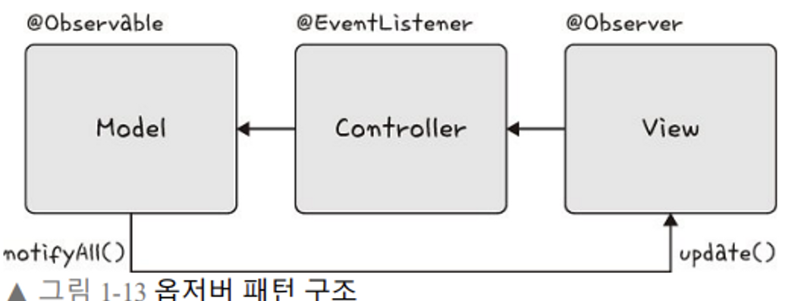

# 옵저버 패턴

### **📌 개념**

- 한 객체의 상태 변화에 따라 다른 객체의 상태도 연동되도록 일대다 객체 의존 관계를 구성하는 패턴
    - 데이터의 변경이 발생했을 경우 상대 클래스나 객체에 의존하지 않으면서 데이터 변경을 통보하고자 할때 유용하다.
- 주체 : 객체의 상태 변화를 보고 있는 관찰자
- 옵저버 : 이 객체의 상태 변화에 따라 전달되는 메서드 등을 기반으로 ‘추가 변화 사항’ 이 생기는 객체

- 옵저버 패턴은 이벤트 기반 시스템에서 사용.
- 우리가 아는 MVC 패턴에도 사용된다!
- 하나의 모델에 대해 다수의 뷰가 옵저버를 통해 모델을 구독하는 형태를 가지고, 이는 컨트롤러의 중재를 받는다.

 

### **📎 장점**

- 객체간의 상호의존성을 최소화할 수 있다.
- OCP 원칙을 지킬 수 있다.

 

### **📎 단점**

- 알림이 가는 순서를 보장할 수 없다.
- 관찰자와 옵저버의 관계를 명확하게 정의해야한다.

 

***
❓ MVC패턴과 옵저버패턴에 대한 참고자료  
https://www.robotstory.co.kr/raspberry/?vid=89

- MVC 모델은 계층 구조이다.
- 만약 A 계층이 B 계층을 사용하게 되면, A 계층은 B 계층은 종속된다.
- B 계층이 없으면, A 계층은 역할을 수행못하게 된다.
- 만약 Model 이 View 의 기능을 사용해야 하는 경우, Model이 View 에 종속되는 것을 어떻게 막을 것인가?
   
    ⇒ 이를 위해 Observer 패턴을 사용한다!
