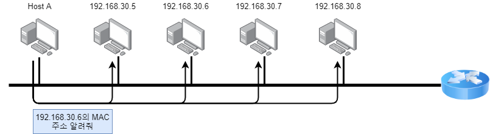
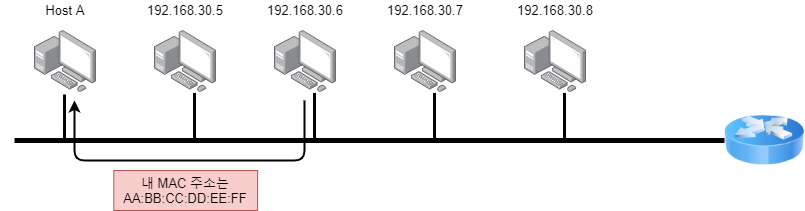
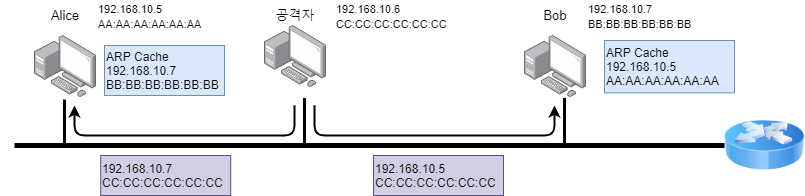
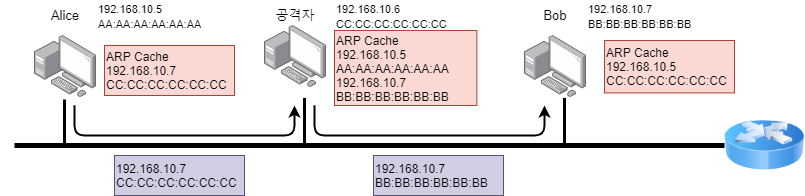
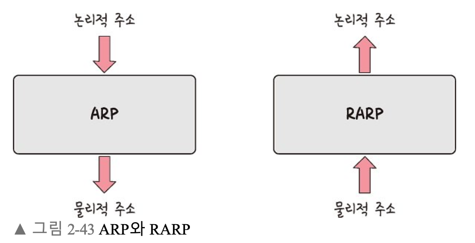
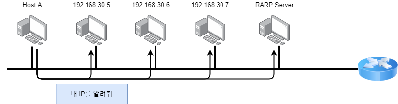
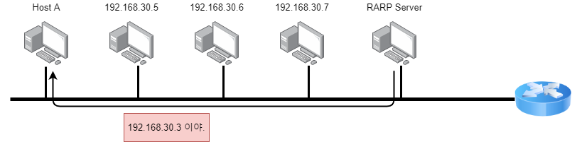
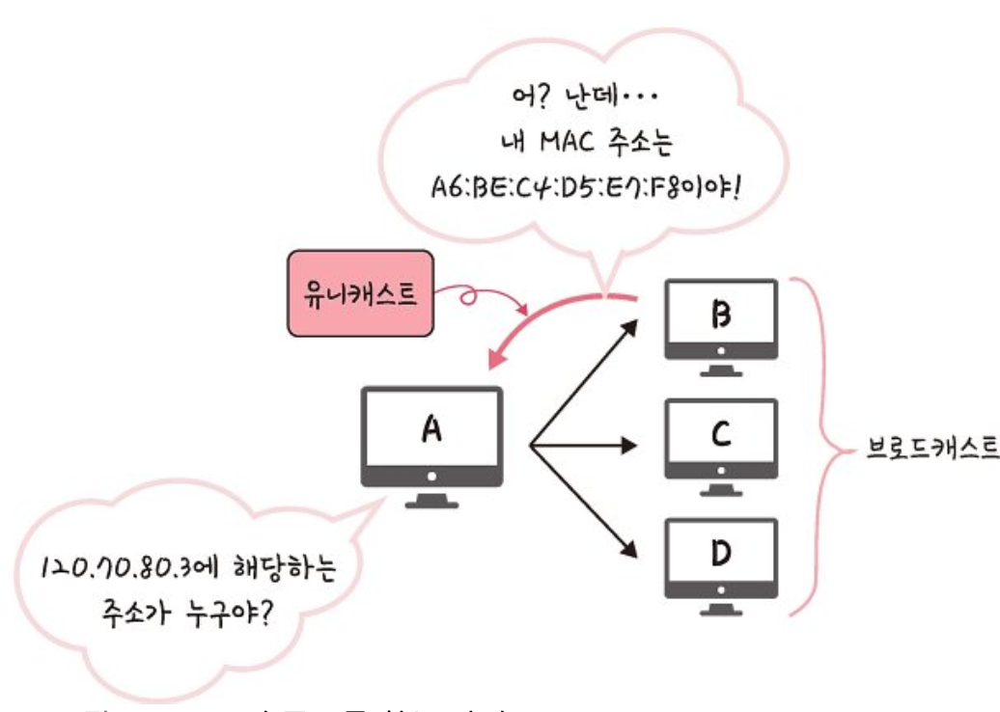

> ➿ 컴퓨터 - 컴퓨터 간 통신은 ‘정확히’ IP 주소에서 ARP를 통해 MAC 주소를 찾아 MAC 주소를 기반으로 통신

IP 주소 : 논리적 주소, 라우터를 기준으로 나누어져 있음
MAC 주소 (하드웨어 주소) : 물리적 주소, 이 세상에 하나밖에 없음 ( 고유한 주소)

같은 네트워크에서는 물리적 주소로 통신 (스위치가 2계층(전송 계층)에서 동작하는 이유)
> 
- ARP (Adress Resolution Protocol)
    - IP주소로부터 MAC 주소를 구하는 IP와 MAC 주소의 다리 역할을 하는 프로토콜
    - 가상 주소인 IP 주소를 실제 주소인 MAC 주소로 변환
    - 동작 방식
        
        
        
        1. 호스트가 IP 주소에 MAC 주소를 모르니까 네트워크 전체에 IP 주소에 대한 MAC 주소를 물어보는 요청을 보냄
        
        
        
        1. 이 IP 주소에 맞는 다른 호스트는 본인의 MAC 주소를 담아서 응답 보냄. 요청 메세지에 자신의 MAC 주소를 요청한 호스트의 IP 주소가 있어서 응답을 곧장 보낼 수 있음
        2. MAC 주소를 알아낸 호스트는 ARP의 정보를 담고 있는 저장소에 IP 주소의 MAC 주소를 업데이트.
        ⇒ 이 저장소 : ARP Cache, 일정 시간 후에 이 정보 삭제
    - ARP 스푸핑
        - ARP Cache Poisoning
        - 공격자가 두 호스트의 통신을 감시하기 위해 두 호스트의 ARP Cache를 변경하는 공격 방법
        - 공격자는 잘못된 정보로 지속적으로 ARP 응답을 보냄
        - 동적으로 ARP 정보가 등록되어있다면 시간이 지나면 삭제되는 것을 이용
        ⇒ 이 때 응답을 받으면 피해 컴퓨터는 잘못된 정보로 ARP Cache를 업데이트하게 됨
        
        
        
        
        
        Alice와 Bob을 속이고 그 당사자인척 하는 공격방법
        
        - (대응)
            - 정적 ARP Cache를 구성하면 시스템 종료시까지 막을 수 있음 & 시스템 가동시마다 ARP를 정적으로 구성
            - ARP Cache의 변경을 감지하는 프로그램 사용
- RARP (Reverse ARP)
    - 실제 주소인 MAC 주소를 가상 주소인 IP 주소로 변환
    
    
    
    - 따로 RARP 서버가 있어야함
    - 자신의 IP를 모를 때 사용
    - 동작 방식
        
        
        
        1. 최초 호스트는 자신의 IP를 모르는 상태이기 때문에 IP를 요청하는 RARP 요청을 브로드캐스팅으로 보냄. 이 때, 요청에 MAC 주소 기재되어 있음
        
        
        
        1. RARP 서버는 요청한 호스트의 IP 주소를 담은 RARP 응답 메세지를 만들어 호스트에게 전송
        
        
        
        ⇒ A가 ARP Request 브로드캐스트를 보내서 IP 주소에 해당하는 MAC 주소 찾음
        ⇒ 해당 주소에 맞는 장치 B가 ‘ARP reply 유니캐스트’를 통해 MAC 주소 반환과정 거쳐 IP 주소에 맞는 MAC 주소 찾게 됨
        
    
    > ➿ 브로드캐스트
    송신 호스트가 전송한 데이터가 네트워크에 연결된 모든 호스트에 전송되는 방식
    
    ➿ 유니캐스트
    고유 주소로 식별된 하나의 네트워크 목적지에 1:1로 데이터를 전송하는 방식
    > 

