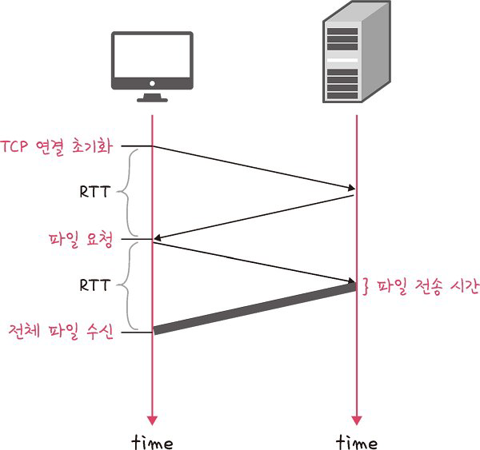
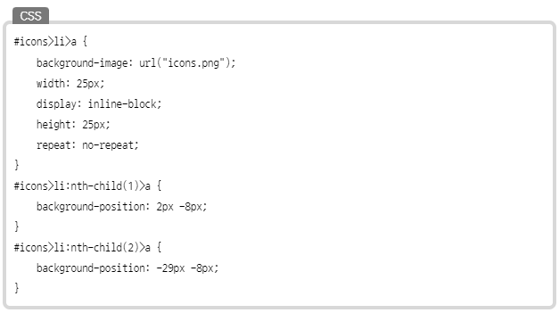
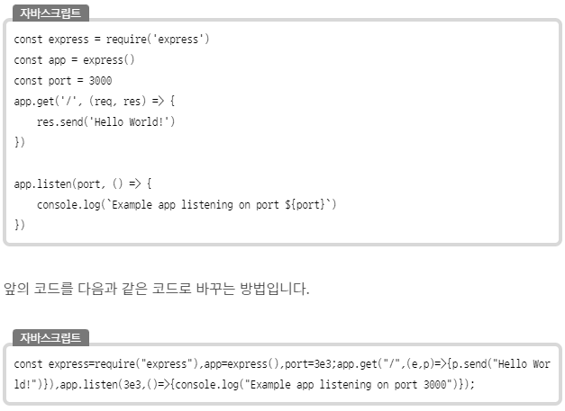

# HTTP : HyperText Transfer Protocol

> **웹에서 브라우저와 서버 간에 데이터를 주고 받기 위한 방식**

# HTTP 특징

1. **Request & Response**

- 클라이언트가 HTTP 요청을 보내면 서버는 요청에 대한 결과를 만들어서 응답한다.
- 웹 관점에서 클라이언트는 브라우저를 의미하며, 아스키 코드 메세지로 소통이 이루어진다.

1. **Stateless**

- HTTP는 상태가 없는 프로토콜이다. 여기서 상태가 없다는 말은 클라이언트와 서버가 서로 연결되어 있는 것이 아니기 때문에 각각의 통신이 독립적이라는 뜻이다.
- 서버가 클라이언트의 상태를 유지하지 않기 때문에 요청을 보낼 때마다 모든 데이터를 매번 보내야 한다.
- 서버가 추가 정보를 관리하지 않아도 되고, 클라이언트가 서버에 요청할 때 데이터를 담아서 보내기 때문에 아무 서버나 호출해도 된다.
- 로그인과 같이 상태를 유지해야만 하는 경우는 쿠키와 세션 등을 사용해서 상태를 유지한다.

# HTTP 메세지 구조

| 구조         | 의미             |
| ------------ | ---------------- |
| start-line   | 시작 라인        |
| header       | HTTP 헤더        |
| CRLF         | 공백 라인        |
| message body | HTTP 메세지 바디 |

### Request 시작 라인

> request-line = method SP request-target SP HTTP-version CRLF(엔터)

- method는 서버가 수행해야 할 동작을 지정한다ex) GET, POST
- request-target은 요청이 전송되는 목표 주소를 가리킨다.
- HTTP-version은 HTTP의 버전을 명시한다.

### Response 시작 라인

> status-line = HTTP-version SP status-code SP reason-phrase CRLF

- HTTP-version은 HTTP의 버전을 명시한다.
- status-code는 HTTP의 응답에 대한 상태를 코드로 표현한다.ex) 200 - 응답 정상 동작
- 그리고 사유 구절로 요청을 처리한 결과로 무엇이 일어났는지 클라이언트에게 알려준다.

# HTTP/1.0

> 한 연결 당 하나의 요청을 처리

### 단점

- 서버로부터 파일을 가져올 때마다 TCP의 3 웨이 핸드세이크를 계속해서 열어야 하기 때문에 RTT가 증가함

<aside>
💡 RTT : 패킷 왕복 시간
- 패킷이 목적지에 도달하고 나서 다시 출발지로 돌아오기까지 걸리는 시간
</aside>

# RTT 증가를 해결하기 위한 방법

- 이미지 스플리팅
- 코드 압축
- 이미지 Base64 인코딩

### 1. 이미지 스플리팅

- 이미지가 합쳐 있는 하나의 이미지를 다운로드받고, 이를 기반으로 background-image의 position을 이용하여 이미지를 표기하는 방법

하나의 이미지 background-image: url("icons.png");, background-position 등을 기반으로 이미지를 설정

### 코드 압축

- 코드를 압축해서 개행 문자, 빈칸을 없애서 코드의 크기를 최소화하는 방법

개행 문자, 띄어쓰기 등이 사라져 코드가 압축되면 코드 용량이 줄어듬

### 3. 이미지 Base64 인코딩

- 이미지 파일을 64진법으로 이루어진 문자열로 인코딩하는 방법

**장점**

- 서버와의 연결을 열고 이미지에 대해 서버에 HTTP 요청을 할 필요가 없다

**\*\***단점**\*\***

- Base64 문자열로 반환활 경우 37% 정도 크기가 더 커짐

<aside>
💡 인코딩
- 정보의 형태나 형식을 표준화, 보안, 처리 속도 향상, 저장 공간 절약 등을 위해 다른 형태나 형식으로 변환하는 처리 방식

</aside>
