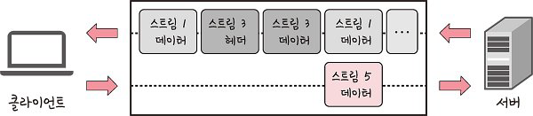
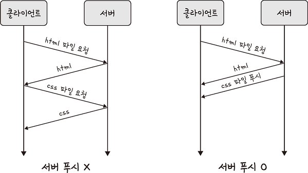

# HTTP 2.0

> HTTP/2는 SPDY 프로토콜에서 파생된 HTTP/1.x보다 지연 시간을 줄이고 응답 시간을 더 빠르게 할 수 있으며 멀티플렉싱, 헤더 압축, 서버 푸시, 요청의 우선순위 처리를 지원하는 프로토콜이다.

**장점**

- 멀티플랙싱
  - 여러 개의 스트림을 사용하여 송수신하는 것.
  - 특정 스트림의 패킷이 손실되었다고 하더라도 해당 스트림에만 영향을 미치고 나머지 스트림은 멀쩡하게 동작할 수 있다.

<aside>
💡 스트림: 시간이 지남에 따라 사용할 수 있게 되는 일련의 데이터 요소를 가리키는 데이터 흐름

</aside>

- 병렬적인 스트림(stream)
  - 스트림 내의 데이터들도 쪼개져 있다. 애플리케이션에서 받아온 메시지를 독립된 프레임으로 조각내어 서로 송수신한 이후 다시 조립하며 데이터를 주고받는다. 이를 통해 단일 연결을 사용하여 병렬로 여러 요청을 받을 수 있고 응답을 줄 수 있다. 이렇게 되면 HTTP/1.x에서 발생하는 문제인 HOL Blocking을 해결할 수 있다.

- 헤더 압축
  - HTTP/2에서는 헤더 압축을 써서 HTTP/1.x의 단점을 커버
  - 허프만 코딩 압축 알고리즘을 사용하는 HPACK 압축 형식을 가짐

<aside>
💡 허프만 코딩: 문자열을 문자 단위로 쪼개 빈도수를 세어 빈도가 높은 정보는 적은 비트 수를 사용하여 표현하고, 빈도가 낮은 정보는 비트 수를 많이 사용하여 표현해서 전체 데이터의 표현에 필요한 비트양을 줄이는 원리
</aside>

 

- 서버 푸시
  - HTTP/1.1에서는 클라이언트가 서버에 요청을 해야 파일을 다운로드받을 수 있었다면, HTTP/2는 클라이언트 요청 없이 서버가 바로 리소스를 푸시할 수 있다.
  - html에는 css나 js 파일이 포함되기 마련인데 html을 읽으면서 그 안에 들어 있던 css 파일을 서버에서 푸시하여 클라이언트에 먼저 줄 수 있습니다.

