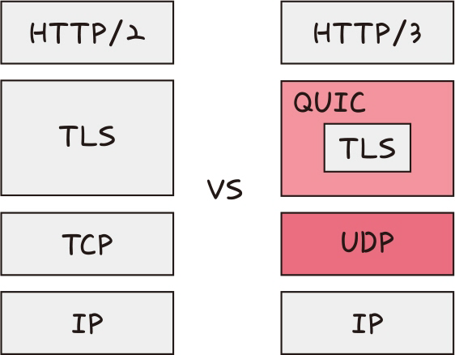
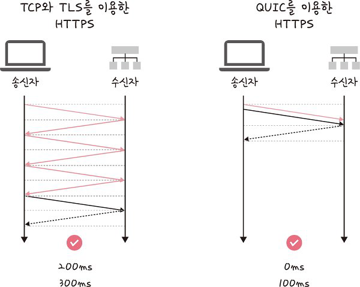

# **HTTP/3**

> TCP 위에서 돌아가는 HTTP/2와는 달리 HTTP/3은 QUIC이라는 계층 위에서 돌아가며, TCP 기반이 아닌 UDP 기반으로 돌아갑니다.

**장점**

- 멀티플렉싱
- 초기 연결 설정 시 지연 시간 감소

### 초기 연결 설정 시 지연 시간 감소

> QUIC은 TCP를 사용하지 않기 때문에 통신을 시작할 때 번거로운 3-웨이 핸드셰이크 과정을 거치지 않아도 됩니다.
>
> QUIC은 첫 연결 설정에 1-RTT만 소요됩니다. 클라이언트가 서버에 어떤 신호를 한 번 주고, 서버도 거기에 응답하기만 하면 바로 본 통신을 시작할 수 있다는 것이죠.
>
> 참고로 QUIC은 순방향 오류 수정 메커니즘(FEC, Forword Error Correction)이 적용되었습니다. 이는 전송한 패킷이 손실되었다면 수신 측에서 에러를 검출하고 수정하는 방식이며 열악한 네트워크 환경에서도 낮은 패킷 손실률을 자랑합니다

