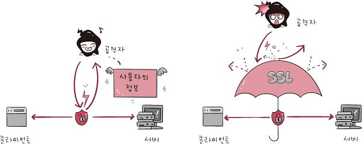
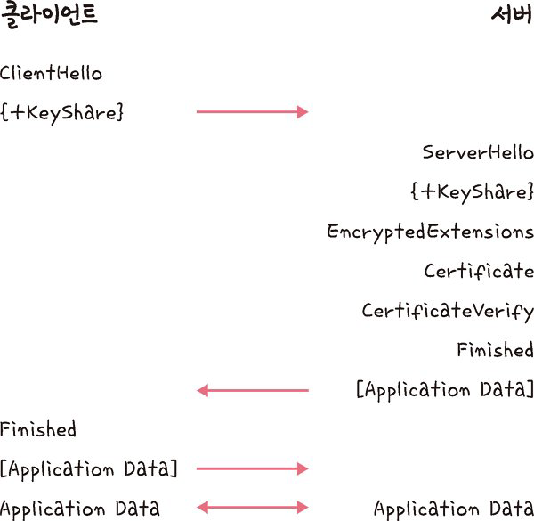
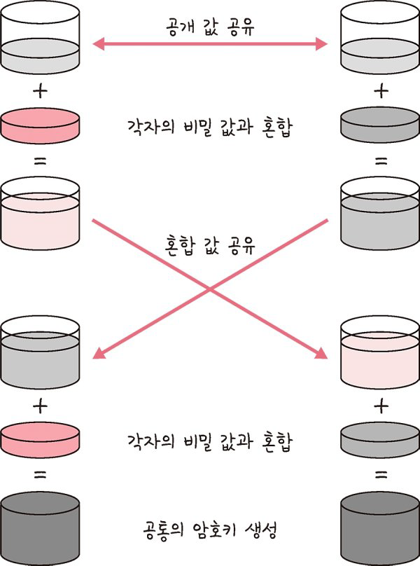

# HTTPS

> HTTPS는 애플리케이션 계층과 전송 계층 사이에 신뢰 계층인 SSL/TLS 계층을 넣은 신뢰할 수 있는 HTTP 요청이다. 이를 통해 ‘통신을 암호화’를 한다.
> HTTP/2는 HTTPS 위에서 동작한다.

## HTTPS 장점 : 보안

#### HTTP 프로토콜의 문제점 : 데이터 도난

- 서버에서부터 브라우저로 전송되는 정보가 암호화되지 않는다. 즉, 데이터가 쉽게 도난당할 수 있다.

#### 해결책 : SSL 인증서

- HTTPS 프로토콜은 SSL(보안 소켓 계층)을 사용함으로써 이 문제를 해결했다. SSL은 서버와 브라우저 사이에 안전하게 암호화된 연결을 만들 수 있게 도와주고, 서버 브라우저가 민감한 정보를 주고받을 때 이것이 도난당하는 것을 막아준다.
- SSL 인증서는 사용자가 사이트에 제공하는 정보를 암호화하는데, 쉽게 말해서 데이터를 암호로 바꾼다. 이렇게 전송된 데이터는 중간에서 누가 훔쳐 낸다고 하더라도 데이터가 암호화되어있기 때문에 해독할 수 없다.

## SSL/TLS : 전송 계층에서 보안을 제공하는 프로토콜

> 클라이언트와 서버가 통신할 때 SSL/TLS를 통해 제3자가 메시지를 도청하거나 변조하지 못하도록 한다.

- SSL/TLS를 통해 공격자가 서버인 척하며 사용자 정보를 가로채는 네트워크상의 ‘인터셉터’를 방지
- SSL/TLS는 보안 세션을 기반으로 데이터를 암호화하며 보안 세션이 만들어질 때 인증 메커니즘, 키 교환 암호화 알고리즘, 해싱 알고리즘이 사용된다.

<aside>
💡 보안 세션
- 보안이 시작되고 끝나는 동안 유지되는 세션
- SSL/TLS는 핸드셰이크를 통해 보안 세션을 생성하고 이를 기반으로 상태 정보 등을 공유

</aside>
 
<aside>
💡 세션
- 운영체제가 어떠한 사용자로부터 자신의 자산 이용을 허락하는 일정한 기간
- 사용자는 일정 시간 동안 응용 프로그램, 자원 등을 사용할 수 있다.

</aside>
 
 

> 클라이언트와 서버와 키를 공유하고 이를 기반으로 인증, 인증 확인 등의 작업이 일어나는 단 한 번의 1-RTT가 생긴 후 데이터를 송수신
>
> 클라이언트에서 사이퍼 슈트(cypher suites)를 서버에 전달하면 서버는 받은 사이퍼 슈트의 암호화 알고리즘 리스트를 제공할 수 있는지 확인합니다. 제공할 수 있다면 서버에서 클라이언트로 인증서를 보내는 인증 메커니즘이 시작되고 이후 해싱 알고리즘 등으로 암호화된 데이터의 송수신이 시작됩니다.

 

### 사이퍼 슈트 : 프로토콜, AEAD 사이퍼 모드, 해싱 알고리즘이 나열된 규약

- TLS_AES_128_GCM_SHA256
- TLS_AES_256_GCM_SHA384
- TLS_CHACHA20_POLY1305_SHA256
- TLS_AES_128_CCM_SHA256
- TLS_AES_128_CCM_8_SHA256

> 예를 들어 TLS_AES_128_GCM_SHA256에는 세 가지 규약이 들어 있는데 TLS는 프로토콜, AES_128_GCM은 AEAD 사이퍼 모드, SHA256은 해싱 알고리즘을 뜻합니다.

  

### AEAD 사이퍼 모드 : Authenticated Encryption with Associated Data

> 데이터 암호화 알고리즘이며 AES_128_GCM 등이 있습니다.
>
> 예를 들어 AES_128_GCM이라는 것은 128비트의 키를 사용하는 표준 블록 암호화 기술과 병렬 계산에 용이한 암호화 알고리즘 GCM이 결합된 알고리즘을 뜻합니다.

 

### 인증 메커니즘

> 인증 메커니즘은 CA(Certificate Authorities)에서 발급한 인증서를 기반으로 이루어집니다. CA에서 발급한 인증서는 안전한 연결을 시작하는 데 있어 필요한 ‘공개키’를 클라이언트에 제공하고 사용자가 접속한 ‘서버가 신뢰’할 수 있는 서버임을 보장합니다. 인증서는 서비스 정보, 공개키, 지문, 디지털 서명 등으로 이루어져 있습니다.

참고로 CA는 아무 기업이나 할 수 있는 것이 아니고 신뢰성이 엄격하게 공인된 기업들만 참여할 수 있으며, 대표적인 기업으로는 Comodo, GoDaddy, GlobalSign, 아마존 등이 있습니다.

>

<aside>
💡 **CA 발급 과정
- 자신의 서비스가 CA 인증서를 발급받으려면 자신의 사이트 정보와 공개키를 CA에 제출해야 합니다. 이후 CA는 공개키를 해시한 값인 지문(finger print)을 사용하는 CA의 비밀키 등을 기반으로 CA 인증서를 발급합니다.**

</aside>

<aside>
💡 **개인키
- 비밀키라고도 하며, 개인이 소유하고 있는 키이자 반드시 자신만이 소유해야 하는 키

공개키

- 공개되어 있는 키\*\*

</aside>

### 암호화 알고리즘

> 키 교환 암호화 알고리즘으로는 대수곡선 기반의 ECDHE(Elliptic Curve Diffie-Hellman Ephermeral) 또는 모듈식 기반의 DHE(Diffie-Hellman Ephermeral)를 사용합니다. 둘 다 디피-헬만(Diffie-Hellman) 방식을 근간으로 만들어졌습니다.

### 디피-헬만 키 교환 암호화 알고리즘

> 암호키를 교환하는 하나의 방법

처음에 공개 값을 공유하고 각자의 비밀 값과 혼합한 후 혼합 값을 공유합니다. 그다음 각자의 비밀 값과 또 혼합합니다. 그 이후에 공통의 암호키가 생성되는 것이죠.

이렇게 클라이언트와 서버 모두 개인키와 공개키를 생성하고 서로에게 공개키를 보내고 공개키와 개인키를 결합하여 PSK(사전 합의된 비밀키)가 생성된다면, 악의적인 공격자가 개인키 또는 공개키를 가지고도 PSK가 없기 때문에 아무것도 할 수 없겠죠? 이를 통해 키를 암호화할 수 있는 것입니다.

### 해싱 알고리즘

> 데이터를 추정하기 힘든 더 작고, 섞여 있는 조각으로 만드는 알고리즘입니다. SSL/TLS는 해싱 알고리즘으로 SHA-256 알고리즘과 SHA-384 알고리즘을 쓰며, 그중 많이 쓰는 SHA-256 알고리즘을 설명하겠습니다.

### SHA-256 알고리즘

> 시 함수의 결괏값이 256비트인 알고리즘이며 비트 코인을 비롯한 많은 블록체인 시스템에서도 씁니다. SHA-256 알고리즘은 해싱을 해야 할 메시지에 1을 추가하는 등 전처리를 하고 전처리된 메시지를 기반으로 해시를 반환합니다.

<aside>
💡 해시
- 다양한 다양한 길이를 가진 데이터를 고정된 길이를 가진 데이터로 매핑(mapping)한 값

해싱

- 임의의 데이터를 해시로 바꿔주는 일이며 해시 함수가 이를 담당

해시 함수

- 임의의 데이터를 입력으로 받아 일정한 길이의 데이터로 바꿔주는 함수

</aside>

참고로 TLS 1.3은 사용자가 이전에 방문한 사이트로 다시 방문한다면 SSL/TLS에서 보안 세션을 만들 때 걸리는 통신을 하지 않아도 됩니다. 이를 0-RTT라고 합니다.

### SEO에도 도움이 되는 HTTPS

구글(Google)은 SSL 인증서를 강조해왔고 사이트 내 모든 요소가 동일하다면 HTTPS 서비스를 하는 사이트가 그렇지 않은 사이트보다 SEO 순위가 높을 것이라고 공식적으로 밝혔습니다.

**SEO(Search Engine Optimization)** 는 검색엔진 최적화를 뜻하며 사용자들이 구글, 네이버 같은 검색엔진으로 웹 사이트를 검색했을 때 그 결과를 페이지 상단에 노출시켜 많은 사람이 볼 수 있도록 최적화하는 방법을 의미

이를 위한 방법으로 캐노니컬 설정, 메타 설정, 페이지 속도 개선, 사이트맵 관리 등이 있습니다.

# HTTPS 구축 방법

1. 직접 CA에서 구매한 인증키를 기반으로 HTTPS 서비스를 구축하는 방법
2. 서버 앞단의 HTTPS를 제공하는 로드밸런서를 두는 방법
3. 서버 앞단에 HTTPS를 제공하는 CDN을 둬서 구축하는 방법
