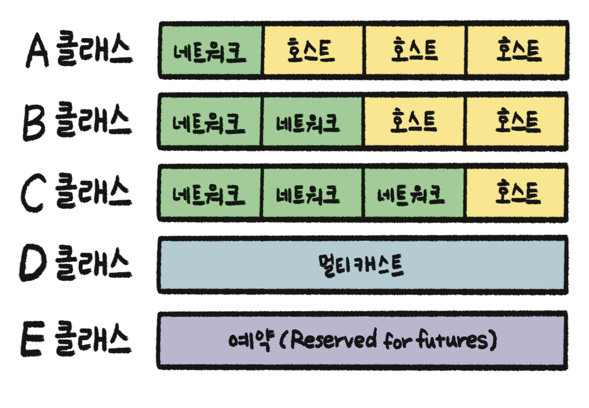
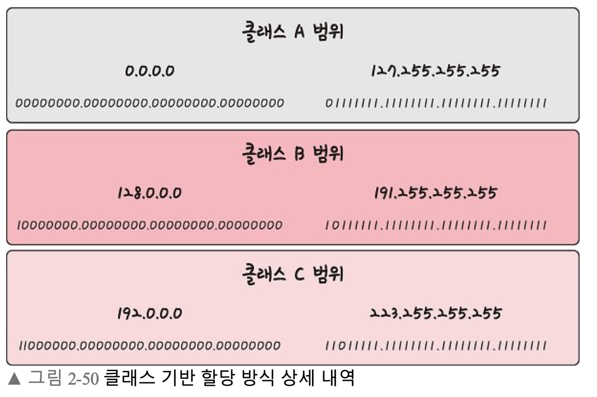
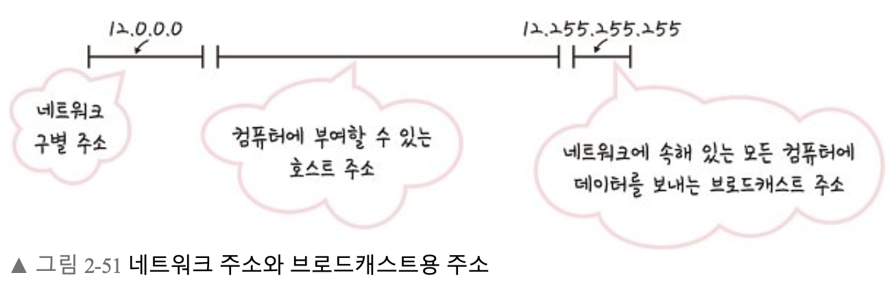
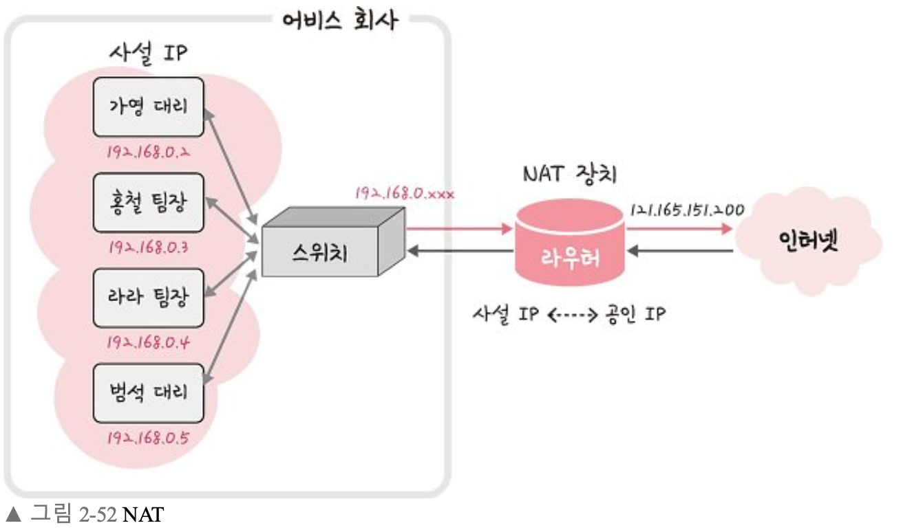

## IPv4

- 32비트를 8비트 단위로 점을 찍어 표기
- 123.45.67.89 같은 방식
- 현재 가장 많이 쓰이는 주소 체계

## IPv6

- 64비트를 16비트 단위로 점을 찍어 표기
- 2001:db8::ff00:42:8329 같은 방식

### IPv4 vs IPv6

|  | IPv4 | IPv6 |
| --- | --- | --- |
| 주소 길이 | 32비트 | 128비트 |
| 표시 방법 | 8비트씩 4부분 10진수 표시 | 16비트 8부분 16진수로 표시 |
| 주소 개수 | 약 43억 개 | 2^128개 |
| 주소 할당 방식 | A, B, C, D 등 클래스 단위 비순차 할당 | 네트워크 규모, 단말기수에 따라 순차할당 |
| 브로드캐스트 주소 | 있음 | 없음
(대신, 로컬범위 내에서 모든 노드에 대한 멀티캐스트 주소 사용) |
| 헤더 크기 | 가변 | 고정 |
| 보안 | IPSec 프로토콜 별도 설치 | IPSec 자체 지원 |
| 서비스 품질 | 제한적 품질 보장 | 확장된 품질 보장 |
| Plug & Play | 불가 | 가능 |

### 클래스 기반 할당 방식

- A, B, C, D, E 다섯 개의 클래스로 구분
- 앞 부분을 네트워크 주소, 뒷 부분을 컴퓨터에 부여하는 호스트 주소로 놓고 사용
- A, B, C
    - 일대일 통신으로 사용
- D
    - 멀티캐스트 통신
- E
    - 앞으로 사용할 예비용
    
    
    
    - 맨 왼쪽 비트 ⇒ ‘구분 비트’
        - A : 0, B : 10, C : 110
- 네트워크의 첫 번째 주소: 네트워크 주소로 사용
- 네트워크의 마지막 주소: 브로드캐스트용 주소, 네트워크에 속해 있는 모든 컴퓨터에 데이터를 보낼 때 사용
    
    
    
    ⇒ 12.0.0.1 ~ 12.255.255.254 : 컴퓨터에 부여할 수 있는 호스트 주소로 사용
    
- (단점) 사용하는 주소보다 버리는 주소가 많음
    
    ⇒ (해결) DHCP, IPv6, NAT
    

### DHCP (Dynamic Hose Configuration Protocol)

- IP 주소 및 기타 통신 매개변수를 자동으로 할당하기 위한 네트워크 관리 프로토콜
- 네트워크 장치의 IP주소를 수동으로 설정할 필요없이 인터넷 접속 시마다 자동으로 IP 주소 할당 가능
- 많은 라우터와 게이트웨이 장비에 DHCP 기능 존재
⇒ 대부분 가정용 네트워크에서 IP주소 할당

### NAT (Network Address Translation)

- 패킷이 라우팅 장치를 통해 전송되는 동안 패킷의 IP주소 정보를 수정하여 IP주소를 다른 주소로 매핑하는 방법
- IPv4 주소 체계만으로는 많은 주소 모두 감당 불가
⇒ NAT로 공인 IP와 사설 IP로 나눠서 많은 주소 처리
- NAT를 가능하게 하는 SW
    - ICS ,RRAS, Netfilter 등
    
    
    
- 하나의 IP를 기반으로 각각의 다른 IP를 가지는 것처럼 인터넷 사용 가능
- NAT 장치를 통해 사설 IP를 공인 IP로 변환하거나 공인 IP를 사설 IP로 변환하는데 쓰임
- 공유기와 NAT
    - NAT 사용 이유
        - 주로 여러 대의 호스트가 하나의 공인 IP 주소를 사용하여 인터넷에 접속하기 위함
        - Ex) 인터넷 회선 하나를 개통하고 인터넷 공유기를 달아 여러 PC 연결해 사용 가능
        → 가능한 이유 : 인터넷 공유기에 NAT 기능이 탑재
- NAT을 이용한 보안
    - 내부 네트워크에서 사용하는 IP주소와 외부에 드러나는 IP 주소를 다르게 유지 가능 → 내부 네트워크에 대한 어느 정도의 보안이 가능
- NAT의 단점
    - 여러 명이 동시에 인터넷 접속하게 되어서 실제 접속하는 호스트 수에 따라 접속 속도가 느려질 수 있음