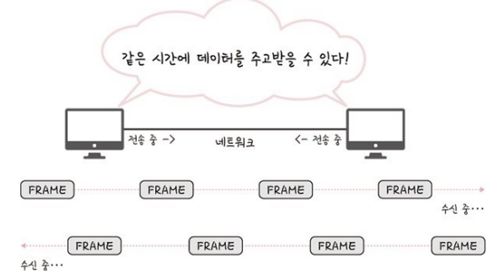
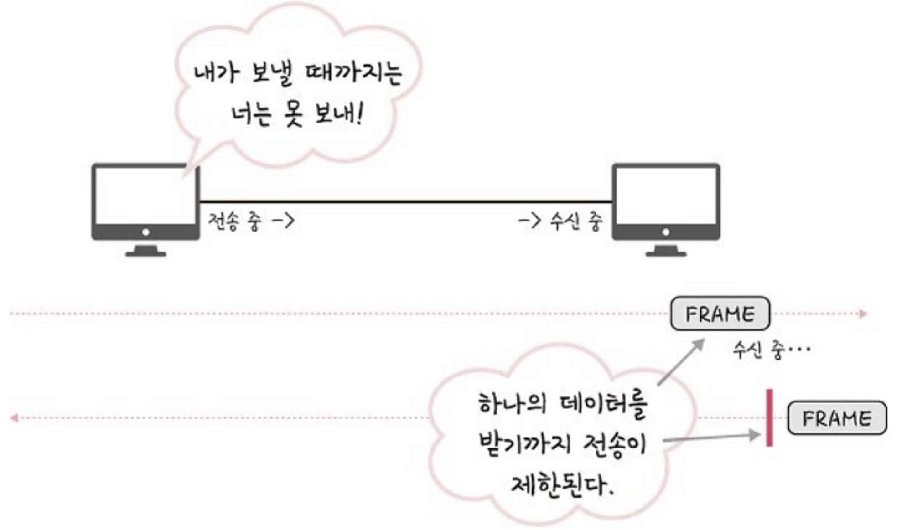
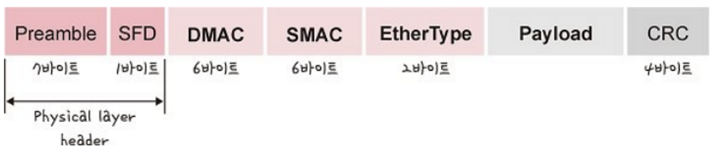
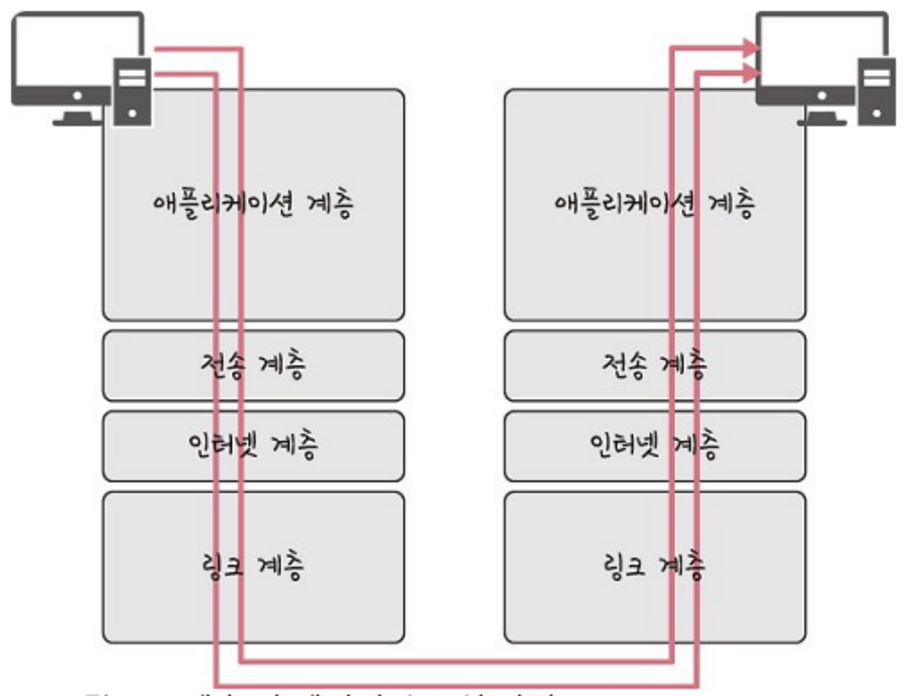

# 계층 구조

그림처럼 TCP/IP 계층과 달리 OSI 계층은 애플리케이션 계층을 세 개로 쪼개고 링크 계층을 데이터 링크 계층, 물리 계층으로 나눠서 표현하는 것이 다르며, 인터넷 계층을 네트워크 계층으로 부른다는 점 이 다르다.

각 계층을 대표하는 스택을 정리한 그림이다.

---

## 애플리케이션 계층

- 애플리케이션을 실행하기 위한 데이터 형식이 작서됨
- 사용자와 가장 가까운 계층으로, 사용자-소프트웨어 간 소통을 담당하는 계층
- 웹 서비스, 이메일 등 서비스를 실질적으로 사람들에게 제공하는 층
- 프로토콜로는 FTP, HTTP, SSH, SMTP, DNS 등이 있음
    - FTP - 장치와 장치 간의 파일을 전송하는데 사용되는 표준 통신 프로토콜
    - SSH - 보안되지 않은 네트워크에서 네트워크 서비스를 안전하게 운영하기 위한 암호화 네트워크 프로토콜
    - HTTP - World Wide Web을 위한 데이터 통신의 기초이자 웹 사이트를 이요하는데 쓰는 프로토콜
    - SMTP - 전자 메일 전송을 위한 인터넷 표준 통신 프로토콜
    - DNS - 도메인 이름과 IP 주소를 매핑해주는 서버

## 전송 계층

- 통신 노드 간 신뢰성 있는 데이터 전송을 보장하는 계층
- 역캡슐화 과정에서 포트번호를 사용해 데이터를 정확한 애플리케이션에 전달하는 역할을 함
    - 네트워크 액세스 계층과 인터넷 계층을 통해 데이터가 목적지 기기까지 정상적으로 도착했다면 전송계층은 포트 번호를 사용해 데이터를 목적지 기기 내 적절한 애플리케이션으로 전달
- 프로토콜로는 TCP, UDP, RTP, RTCP 등이 있음
    - TCP - 패킷 사이의 순서를 보장하고 연결지향 프로토콜을 사용해서 연결을 하여 신뢰를 구축해서 수신 여부을 확인하며 ‘가상회선 패킷 교환 방식’을 사용
    - UDP - 순서를 보장하지 않고 수신 여부를 확인하지 않으며 단순히 데이터만 주는 ‘데이터그램 패킷 교환 반식’을 사용

> 가상회선 패킷 교환

각 패킷에는 가상회선 식별자가 포함되며 모든 패킷을 전송하면 가상회선이 해제되고 패킷들은 전송된 ‘순서대로’ 도착하는 방식

> 데이터그램 패킷 교환 방식

패킷이 독립적으로 이동하며 최적의 경로를 선택하여 가는데, 하나으메시지에서 분할된 여러 패킷은 서로 다른 경로로 전송될 수 있으며 도착한 ‘순서가 다를 수’ 있는 방식

> TCP 연결 성립 과정

TCP는 신뢰성을 확보할 때 ‘3-웨이 핸드셰이크’라는 작업을 진행

클라이언트와 서버가 통신할 때 세단계 과정을 거친다

1. SYN 단계: 클라이언트는 서버에 클라이언트의 ISN을 담아 SYN을 보냅니다. ISN은 새로운 TCP 연결의 첫 번째 패킷에 할당된 임의의 시퀀스 번호를 말하며(예시로 12010을 들었습니다) 이는 장치마다 다를 수 있습니다.
2. SYN + ACK 단계: 서버는 클라이언트의 SYN을 수신하고 서버의 IS N을 보내며 승인번호로 클라이언트의 ISN + 1을 보냅니다.
3. ACK 단계: 클라이언트는 서버의 ISN + 1한 값인 승인번호를 담아 A CK를 서버에 보냅니다.

3-웨이 핸드셰이크 과정 이후 신뢰성이 구축되고 데이터 전송 을 시작합니다. 참고로 TCP는 이 과정이 있기 때문에 신뢰성이 있는 계층이라고 하며 UDP는 이 과정이 없기 때문에 신뢰성이 없는 계층이 라고 합니다.

> TCP 연결 해제 과정

TCP가 연결을 해제할 때는 4-웨이 핸드셰이크 과정

1. 먼저 클라이언트가 연결을 닫으려고 할 때 FIN으로 설정된 세그 먼트를 보냅니다. 그리고 클라이언트는 FIN_WAIT_1 상태로 들어가 고 서버의 응답을 기다립니다.
2. 서버는 클라이언트로 ACK라는 승인 세그먼트를 보냅니다. 그리 고 CLOSE_WAIT 상태에 들어갑니다. 클라이언트가 세그먼트를 받으 면 FIN_WAIT_2 상태에 들어갑니다.
3. 서버는 ACK를 보내고 일정 시간 이후에 클라이언트에 FIN이라 는 세그먼트를 보냅니다.
4. 클라이언트는 TIME_WAIT 상태가 되고 다시 서버로 ACK를 보 내서 서버는 CLOSED 상태가 됩니다. 이후 클라이언트는 어느 정도 의 시간을 대기한 후 연결이 닫히고 클라이언트와 서버의 모든 자원 의 연결이 해제됩니다.

> TIME_WAIT !! 왜 굳이 일정 시간 뒤에 닫을까?

- 지연 패킷이 발생할 경우를 대비하기 위함
    - 패킷이 뒤늦게 도달하고 이를 처리하지 못한다면 데이터 무결성 문제
- 두 장치가 연결이 닫혔는지 확인하기 위해서
    - LAST_ACK 상태에서 닫히게 되면 다시 새로운 연결을 하려고 할때 장치는 줄곧 LAST_ACK으로 되어있기 때문에 접속 오류가 나타남
- 

## 인터넷 계층

- 패킷을 최종 목적지까지 라우팅하는 계층
- 패킷을 수신해야할 상대의 주소를 지정하여 데이터를 전달
- 상대방이 제대로 받았는지에 대해 보장하지 않는 비연결형적인 특징
- 프로토콜로는 IP, ARP, ICMP, RARP, OSPF 등이 있음

 

---

## 링크 계층

- 전선, 광섬유, 무선 등으로 실질적으로 데이터를 전달하며 장치 간에 신호를 주고받는 ‘**규칙**’을 정하는 계층
- 신뢰성 있는 데이터 전송을 담당한다.
- OSI 7 에서는 물리 계층, 데이터 링크 계층에 해당한다.
    - **물리 계층** : 유,무선 LAN 을 통해 0, 1로 이루어진 데이터를 보내는 계층
    - **데이터 링크 계층** : ‘**이더넷 프레임**’ 을 통해 에러 확인, 흐름 제어, 접근 제어를 담당하는 계층
- MAC 주소가 사용됨
    - MAC 주소 : 컴퓨터, 노트북 등 각 장치에는 네트워크를 연결하기 위한 장치(LAN 카드)가 있는데, 이를 구별하기 위한 식별번호를 말함.
    - 물리적 주소로, 전세계에서 유일한 번호로 할당된다.
    - 6바이트 (48비트)로 구성

### 이더넷?

- 가정이나 건물 같은 로컬 환경의 컴퓨터 및 장치를 네트워크에 연결하기 위한 통신 표준 방식
- 근거리 통신망 기술이다.
- CSMA/CD 프로토콜을 사용
- LAN, WAN 및 WAN 에서 사용되는 방식이다.

**이더넷의 장점**

- 적은 용량의 데이터를 전송할 경우 성능이 우수하다.
- 설치 비용이 저렴하고 관리가 쉽다.
- 네트워크 구조가 단순하다.

**이더넷의 단점**

- 네트워크 사용 시에 신호 때문에 충돌이 발생한다.
- 충돌이 발생하면 네트워크에서 지연이 발생한다.
- 시스템의 부하가 증가하면 충돌도 계속적으로 증가한다.

### 유선 LAN (IEEE802.3)

- 유선 LAN 을 이루는 이더넷은 IEEE802.3 프로토콜을 따르며, 전이중화 통신을 사용
- 유선 LAN 을 이루는 케이블에는 TP 케이블, 트위스트 페어 케이블, 광섬유 케이블이 있다.

### 전이중화 통신

- 양쪽 장치가 동시에 송수신 할 수 있는 방식
- 송신로와 수신로로 나눠서 데이터를 주고받을 수 있음. 수신로, 송신로 2쌍의 전송로가 존재
- 현대의 고속 이더넷은 전이중화 통신 방식 기반.

### 무선 LAN (IEEE802.11)

- 무선 신호 전달 방식을 이용해 두 대 이상의 장치를 연결하는 기술
- 케이블 대신 무선 주파수를 이용
- 수신과 송신에 같은 채널을 사용하므로, 반이중화 통신을 사용한다.
- 주파수 대역은 2.4GHz 또는 5GHz 대역 중 하나를 사용해서 구축한다.
- 2.4GHz : 장애물에 강하지만 전자레인지, 무선 등 전파 간섭이 일어나는 경우가 많음
- 5GHz : 사용할 수 있는 채널 수도 많고 동시에 사용할 수 있음. 상대적으로 깨끗한 전파 환경 구축 가능

### 반이중화 통신

- 양쪽 장치가 송수신할 때 하나의 전송로만 존재
- 양쪽 장치는 송수신할 수 있지만, 동시에 통신할 수는 없음
- 장치가 신호를 수신하기 시작하면 응답하기 전에 전송이 완료될 때까지 기다려야 함.
- 둘 이상의 장치가 동시에 전송하면 충돌이 발생해 메시지가 손실될 수 있음.
    
    ⇒ 충돌 방지 시스템 필요
    

### CSMA/CD

- 유선 LAN 에서 사용되는 ‘**반이중화 통신’** 방식 중 하나
- 데이터를 보낸 이후 충돌이 발생하면, 일정 시간 이후 재전송을 하는 방식이다.
- 수신로, 송신로를 각각 두는게 아니고, 하나의 경로를 기반으로 데이터를 보내기 때문에 데이터를 보낼 때 충돌에 대해 대비해야 했으므로 사용함.

### CSMA/CA

- 반이중화 통신 중 하나로 장치에서 데이터를 보내기 전 사전에 감지 가능한 충돌을 방지하는 방식
1. 데이터를 송신하기 전 무선 매체를 살핀다.
2. 캐리어 감지 : 회선이 비어 있는지를 판단한다.
3. IFS (Inter FrameSpace) : 랜덤 값을 기반으로 정해진 시간만큼 기다리며, 만약 무선매체가 사용중이면 점차 그 간격을 늘려가며 기다린다.
4. 이후 데이터를 송신한다.

### 와이파이

- 전자 기기들이 무선 LAN 신호에 연결할 수 있게 하는 기술
- 이를 사용하기 위해선 무선 접속 장치 (AP, Access Point) 가 필요. 이를 공유기라고 함.
- 공유기를 통해 유선 LAN 에 흐르는 신호를 무선 LAN 신호로 바꿔주어 신호가 닿는 범위 내에서 무선 인터넷을 사용할 수 있게 됨
- 무선 LAN 을 이용한 기술은 와이파이 뿐만 아니라 지그비, 블루투스 등이 있다.

### BSS

- Basic Service Set. 기본 서비스 집합을 의미
- 동일 BSS 내에 있는 AP (Access Point) 들과 장치들이 서로 통신 가능한 구조를 뜻함
- 단순 공유기를 통해 네트워크를 접속하는게 아님
- 근거리 무선 통신을 제공
- 하나의 AP 만을 기반으로 구축되어 있어 사용자가 한 곳에서 다른 곳으로 자유롭게 이동해 네트워크에 접속하는 것은 불가능하다.

### ESS

- Extended Service Set. 하나 이상의 연결된 BSS 그룹
- 장거리 무선 통신을 제공
- BSS 보다 더 많은 가용성과 이동성을 지원함
- 사용자는 한 장소에서 다른 장소로 이동하며 중단 없이 네트워크에 계속 연결할 수 있음

### 이더넷 프레임

- 데이터 링크 계층은 이더넷 프레임을 통해 전달받은 데이터의 에러를 검출하고, 캡슐화함.
- 이더넷 프레임의 구조

- Preamble : 이더넷 프레임의 시작임을 알림
- SFD (Start Frame Delimiter) : 다음 바이트부터 MAC 주소 필드가 시작됨을 알림
- DMAC , SMAC : 수신, 송신 MAC 주소
- EtherType : 데이터 계층 위의 계층인 IP 프로토콜을 정의함. ex) IPv4, IPv6
- Payload : 전달받은 데이터
- CRC : 에러 확인 비트

### 계층 간 데이터 송수신 과정

컴퓨터를 통해 다른 컴퓨터로 데이터를 요청한다면? HTTP 를 통해 웹 서버에 있는 데이터를 요청하면?

유저가 보내는 request 값을 애플리케이션 계층부터 캡슐화 과정을 거쳐서 전달되고, 링크 계층을 통해 서버와 통신을 하고, 해당 서버의 링크 계층으로부터 애플리케이션 계층까지 비캡슐화 과정을 거쳐 데이터가 전송된다.

### 캡슐화 과정

- 상위계층에서 하위계층으로 데이터를 전달할 때, 상위 계층의 헤더와 데이터를 하위 계층의 데이터 부분에 포함시키고, 해당 계층의 헤더를 삽입하는 과정을 뜻함.

- 애플리케이션 계층의 데이터가 전송 계층으로 전달되면서 ‘세그먼트’ 또는 ‘데이터그램’화 되면서 TCP(L4) 헤더가 붙여지게 됨.
- 인터넷 계층으로 가면서, IP(L3) 헤더가 붙여지며, ‘패킷’화가 된다.
- 링크 계층으로 전달되면서 프레임 헤더와 프레임 트레일러가 붙어 ‘프레임’화가 됨.

### 비캡슐화 과정

- 하위 계층에서 상위 계층으로 가며 각 계층의 헤더 부분을 제거하는 과정을 뜻함.

- 캡슐화된 데이터를 받으면, 링크 계층에서부터 타고 올라오면서 프레임화된 데이터가 다시 패킷화를 거치고, 세그먼트를 거쳐 메시지화가 되는 비캡슐화 과정을 거침.
- 그 이후 최종적으로 사용자에게 애플리케이션의 PDU 인 메시지로 전달된다.

### PDU

- 네트워크의 어떤 계층에서 다른 계층으로 데이터가 전달될 때 전달되는 덩어리의 단위를 PDU 라고 한다.
- PDU 는 제어 관련 정보들이 포함된 ‘헤더’ , 데이터를 의미하는 ‘페이로드’ 로 구성되어 있음.
- 페이로드는 계층마다 부르는 명칭이 다르다.

- 애플리케이션 계층: 메시지
- 전송 계층: 세그먼트(TCP), 데이터그램(UDP)
- 인터넷 계층: 패킷
- 링크 계층: 프레임(데이터 링크 계층), 비트(물리 계층)

curl 을 통해 다른 사이트로 요청 보낼 수 있음. 애플리케이션 계층의 PDU 확인.

- 애플리케이션 계층의 헤더, 메시지 모두 문자열이다. 헤더에 authorization 값 등 다른 값들을 넣는 확장이 쉽기 때문!