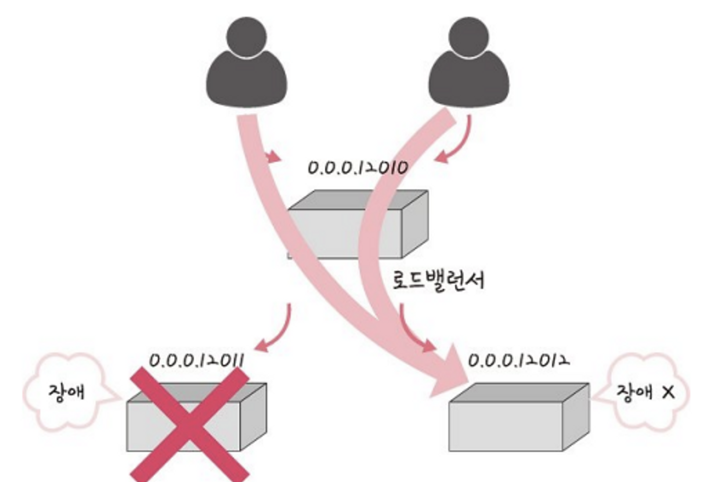
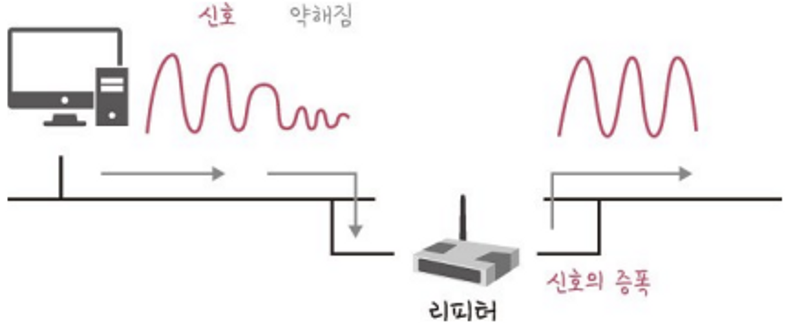

> 네트워크는 여러 네트워크 기기를 기반으로 구축된다. \
네트워크는 여러 기기 간에 망으로 구성된다. 서로 통신할 수 있게 된다. \
네트워크 기기는 계층 별로 처리 범위를 나눌 수 있다.
> 

 

- 애플리케이션 계층 : L7 스위치
- 인터넷 계층 : L3 스위치
- 데이터 링크 계층 : L2 스위치, 브리지
- 물리 계층 : NIC, 리피터, AP

 

### 네트워크 스위치

- 컴퓨터와 같은 2 개 이상의 IT 기기가 서로 통신할 수 있도록 허용하는 장비.
- 데이터 통신을 중재하고, 목적지가 연결된 포트로만 전기 신호를 보내 데이터를 전송하는 통신 네트워크 장비.

 

---

## 애플리케이션 계층

### L7 스위치

- 애플리케이션 계층을 처리하는 기기
- 로드밸런서라고도 함. 서버의 부하를 분산하는 기기
- 클라이언트로부터 오는 요청들을 뒤쪽의 여러 서버로 나누는 역할을 함
- 트래픽을 분산시켜, 클라이언트의 요청을 최대한 많이 처리하도록 시스템이 처리할 수 있는 트래픽을 증가시키는게 목표
- URL, 서버, 캐시, 쿠키들을 기반으로 트래픽을 분산한다.
- 바이러스, 불필요한 외부 데이터 등을 걸러내는 필터링 기능 또한 가지고 있음
- 만약 장애가 발생한 서버가 있으면, 이를 트래픽 분산 대상에서 제외해야 한다. 이는 정기적으로 헬스 체크(health check) 를 이용해 감시하면서 이루어진다.

### 헬스 체크 (health check)

- 정상적인 서버와 장애가 발생한 서버를 판별하기 위해 사용
- 전송 주기, 재전송 횟수 등을 설정한 후 반복적으로 서버에 요청을 보내는 것을 말함
- 서버에 부하가 되지 않을 만큼 요청 횟수가 적절해야 한다.
- TCP, HTTP 등 다양한 방법으로 요청을 보낼 수 있음
    
    ex) TCP 요청을 보냈는데, 3-way handshake 가 정상적으로 일어나지 않으면 비정상적인 서버로 간주
    

### L4 스위치와 L7 스위치 차이

- L4, L7 스위치 모두 로드밸런서가 있다.

**L4 스위치**

- L4 스위치는 전송 계층을 처리하는 기기.
- 스트리밍 관련 서비스에서는 사용할 수 없음.
- 메시지를 기반으로 인식하지 못하고, IP 와 포트를 기반으로 트래픽을 분산한다.
- NLB 컴포넌트

**L7 스위치**

- IP, 포트, URL, 헤더, 쿠키 등을 기반으로 트래픽을 분산함
- 클라우드 서비스 (AWS 등) 에서도 L7 스위치를 이용해 로드밸런싱을 제공함
- ALB 컴포넌트

### 로드밸런서를 이용한 서버 이중화

- 서비스를 안정적으로 운용하기 위해서, 2대 이상의 서버는 필수적임.
- 에러가 발생해 서버 1대가 종료되더라도, 서비스를 안정적으로 운용되어야 함
- 로드밸런서를 통해, 2대 이상의 서버를 기반으로 가상 IP 를 제공하고, 이를 기반으로 안정적인 서비스를 제공한다.

- 로드밸런서가 제공한 0.0.0.12010 이란 가상 IP 에 사용자들이 접근하면, 뒷단에 사용 가능한 서버인 0.0.0.12011 과 0.0.0.12012 를 기반으로 서빙함
- 0.0.0.12011 에서 장애가 발생해도, 0.0.0.12012 는 정상 동작하므로 이 서버를 기반으로 안정적인 서비스를 운용할 수 있게 된다.

---

## 인터넷 계층

### 라우터

- 여러 개의 네트워크를 연결, 분할, 구분시켜주는 역할
- 다른 네트워크에 존재하는 장치끼리 서로 데이터를 주고받을 때 패킷 소모를 최소화하고 경로를 최적화해 최소 경로로 패킷을 포워딩 하는 라우팅 장비
- 소프트웨어 기반, 하드웨어 기반으로 나눠진다.

### L3 스위치

- L2 스위치의 기능과 라우팅 기능을 갖춘 장비
- 라우터로 봐도 무방하다.
- L3 스위치는 하드웨어 기반의 라우팅을 담당

 

<strong>L3, L2 스위치 비교</strong>

| 구분 | L2 스위치 | L3 스위치 |
| --- | --- | --- |
| 참조 테이블 | MAC 주소 테이블 | 라우팅 테이블 |
| 참조 PDU | 이더넷 프레임 | IP 패킷 |
| 참조 주소 | MAC 주소 | IP 주소 |
---

## 데이터 링크 계층

### L2 스위치

- 장치들의 MAC 주소를 MAC 주소 테이블을 통해 관리
- 특정 장치로 패킷 전송을 담당
- IP 주소를 이해하지 못하므로 IP 주소 기반 라우팅은 불가
- 단순히 패킷의 MAC 주소를 읽어 스위칭 하는 역할
- 목적지가 MAC 주소 테이블에 없으면 전체 포트에 전달
- MAC 주소 테이블의 주소들은 일정 시간 이후 삭제

### 브리지

- 두 개의 LAN (근거리 통신망(을 상호 접속할 수 있게 하는 통신망 연결 장치
- 포트와 포트 사이의 다리 역할
- 장치에서 받아온 MAC 주소를 MAC 주소 테이블로 관리
- 서로 다른 LAN 으로 이루어진 통신망을 구축할 때 사용

L2 스위치는 여러 개의 포트 중 특정 포트로만 전송, 브리지는 모든 포트에게 전송

---

## 물리 계층

### NIC

- 네트워크 인터페이스 카드(NIC, = LAN 카드)
- 2 대 이상의 컴퓨터 네트워크를 구성하는데 사용
- 네트워크와 빠른 속도로 데이터를 송수신할 수 있도록 컴퓨터 내에 설치하는 확장 카드
- 각 LAN 카드에는 고유 MAC 주소가 있다.

### 리피터

- 들어오는 약해지는 신호를 증폭해 다른 쪽으로 전달하는 장치

- 리피터를 통해 패킷이 더 멀리 갈 수 있음
- 광케이블이 보급되면서 현재는 잘 쓰이지 않음

### AP

- Access Point. 패킷을 복사하는 기기
- AP에 유선 LAN 을 연결해 다른 장치에서 무선 LAN 기술을 사용해 무선 네트워크 연결을 할 수 있음
- 무선 장치들을 유선 장치에 연결할 수 있게 하는 장치