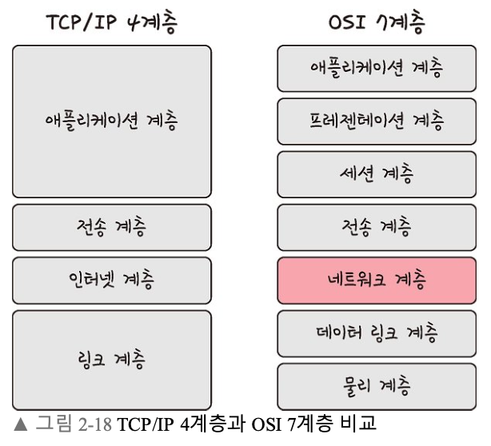
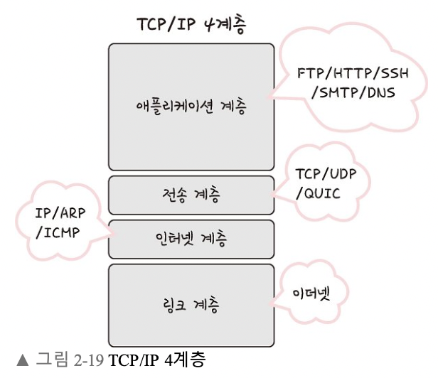
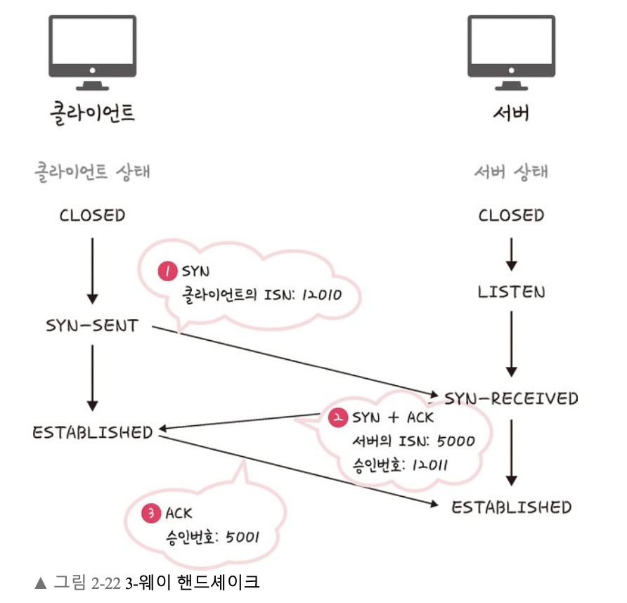
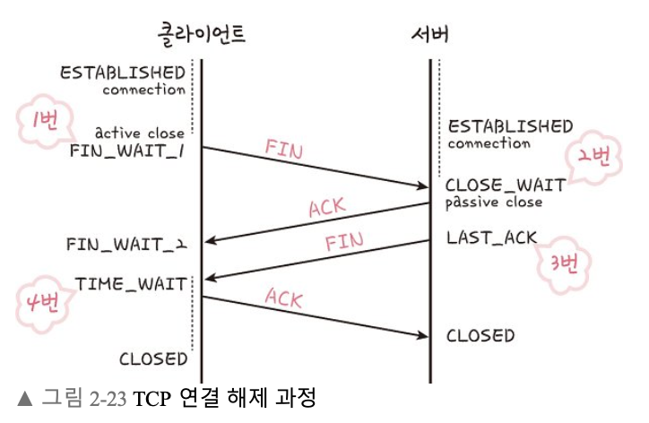

# 계층 구조

그림처럼 TCP/IP 계층과 달리 OSI 계층은 애플리케이션 계층을 세 개로 쪼개고 링크 계층을 데이터 링크 계층, 물리 계층으로 나눠서 표현하는 것이 다르며, 인터넷 계층을 네트워크 계층으로 부른다는 점 이 다르다.

각 계층을 대표하는 스택을 정리한 그림이다.

---

## 애플리케이션 계층

- 애플리케이션을 실행하기 위한 데이터 형식이 작서됨
- 사용자와 가장 가까운 계층으로, 사용자-소프트웨어 간 소통을 담당하는 계층
- 웹 서비스, 이메일 등 서비스를 실질적으로 사람들에게 제공하는 층
- 프로토콜로는 FTP, HTTP, SSH, SMTP, DNS 등이 있음
    - FTP - 장치와 장치 간의 파일을 전송하는데 사용되는 표준 통신 프로토콜
    - SSH - 보안되지 않은 네트워크에서 네트워크 서비스를 안전하게 운영하기 위한 암호화 네트워크 프로토콜
    - HTTP - World Wide Web을 위한 데이터 통신의 기초이자 웹 사이트를 이요하는데 쓰는 프로토콜
    - SMTP - 전자 메일 전송을 위한 인터넷 표준 통신 프로토콜
    - DNS - 도메인 이름과 IP 주소를 매핑해주는 서버

## 전송 계층

- 통신 노드 간 신뢰성 있는 데이터 전송을 보장하는 계층
- 역캡슐화 과정에서 포트번호를 사용해 데이터를 정확한 애플리케이션에 전달하는 역할을 함
    - 네트워크 액세스 계층과 인터넷 계층을 통해 데이터가 목적지 기기까지 정상적으로 도착했다면 전송계층은 포트 번호를 사용해 데이터를 목적지 기기 내 적절한 애플리케이션으로 전달
- 프로토콜로는 TCP, UDP, RTP, RTCP 등이 있음
    - TCP - 패킷 사이의 순서를 보장하고 연결지향 프로토콜을 사용해서 연결을 하여 신뢰를 구축해서 수신 여부을 확인하며 ‘가상회선 패킷 교환 방식’을 사용
    - UDP - 순서를 보장하지 않고 수신 여부를 확인하지 않으며 단순히 데이터만 주는 ‘데이터그램 패킷 교환 반식’을 사용

> 가상회선 패킷 교환

각 패킷에는 가상회선 식별자가 포함되며 모든 패킷을 전송하면 가상회선이 해제되고 패킷들은 전송된 ‘순서대로’ 도착하는 방식

> 데이터그램 패킷 교환 방식

패킷이 독립적으로 이동하며 최적의 경로를 선택하여 가는데, 하나으메시지에서 분할된 여러 패킷은 서로 다른 경로로 전송될 수 있으며 도착한 ‘순서가 다를 수’ 있는 방식

> TCP 연결 성립 과정

TCP는 신뢰성을 확보할 때 ‘3-웨이 핸드셰이크’라는 작업을 진행

클라이언트와 서버가 통신할 때 세단계 과정을 거친다

1. SYN 단계: 클라이언트는 서버에 클라이언트의 ISN을 담아 SYN을 보냅니다. ISN은 새로운 TCP 연결의 첫 번째 패킷에 할당된 임의의 시퀀스 번호를 말하며(예시로 12010을 들었습니다) 이는 장치마다 다를 수 있습니다.
2. SYN + ACK 단계: 서버는 클라이언트의 SYN을 수신하고 서버의 IS N을 보내며 승인번호로 클라이언트의 ISN + 1을 보냅니다.
3. ACK 단계: 클라이언트는 서버의 ISN + 1한 값인 승인번호를 담아 A CK를 서버에 보냅니다.

3-웨이 핸드셰이크 과정 이후 신뢰성이 구축되고 데이터 전송 을 시작합니다. 참고로 TCP는 이 과정이 있기 때문에 신뢰성이 있는 계층이라고 하며 UDP는 이 과정이 없기 때문에 신뢰성이 없는 계층이 라고 합니다.

> TCP 연결 해제 과정

TCP가 연결을 해제할 때는 4-웨이 핸드셰이크 과정

1. 먼저 클라이언트가 연결을 닫으려고 할 때 FIN으로 설정된 세그 먼트를 보냅니다. 그리고 클라이언트는 FIN_WAIT_1 상태로 들어가 고 서버의 응답을 기다립니다.
2. 서버는 클라이언트로 ACK라는 승인 세그먼트를 보냅니다. 그리 고 CLOSE_WAIT 상태에 들어갑니다. 클라이언트가 세그먼트를 받으 면 FIN_WAIT_2 상태에 들어갑니다.
3. 서버는 ACK를 보내고 일정 시간 이후에 클라이언트에 FIN이라 는 세그먼트를 보냅니다.
4. 클라이언트는 TIME_WAIT 상태가 되고 다시 서버로 ACK를 보 내서 서버는 CLOSED 상태가 됩니다. 이후 클라이언트는 어느 정도 의 시간을 대기한 후 연결이 닫히고 클라이언트와 서버의 모든 자원 의 연결이 해제됩니다.

> TIME_WAIT !! 왜 굳이 일정 시간 뒤에 닫을까?

- 지연 패킷이 발생할 경우를 대비하기 위함
    - 패킷이 뒤늦게 도달하고 이를 처리하지 못한다면 데이터 무결성 문제
- 두 장치가 연결이 닫혔는지 확인하기 위해서
    - LAST_ACK 상태에서 닫히게 되면 다시 새로운 연결을 하려고 할때 장치는 줄곧 LAST_ACK으로 되어있기 때문에 접속 오류가 나타남
- 

## 인터넷 계층

- 패킷을 최종 목적지까지 라우팅하는 계층
- 패킷을 수신해야할 상대의 주소를 지정하여 데이터를 전달
- 상대방이 제대로 받았는지에 대해 보장하지 않는 비연결형적인 특징
- 프로토콜로는 IP, ARP, ICMP, RARP, OSPF 등이 있음