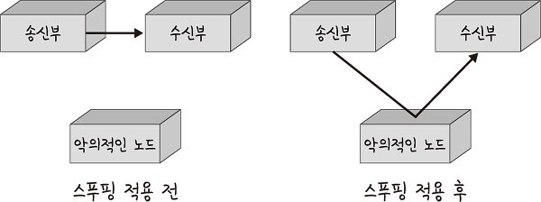
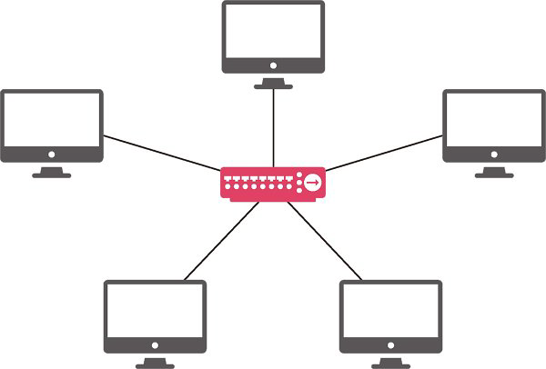
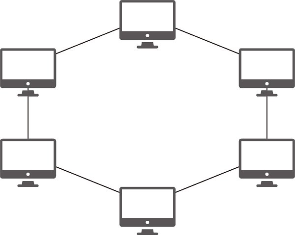
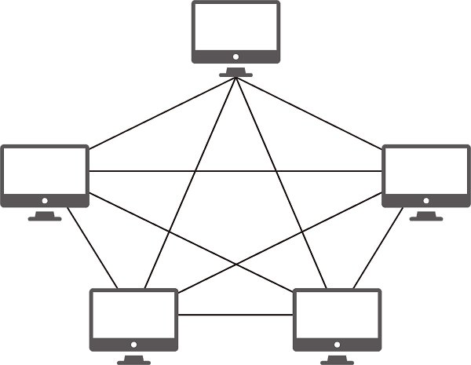

# 네트워크 토폴로지 (network topology)
> 노드와 링크가 어떻게 배치 되어 있는지에 대한 방식이자 연결 형태.

---

## 1. 트리 토폴로지 (Tree Topology)
> 계층형 토폴로지.
> 트리 형태로 배치된 네트워크 구성.

**장점**
- 노드의 추가, 삭제가 쉽다.

**단점**
- 특정 노드에 트래픽 집중될 때 하위 노드에 영향을 준다.

---

## 2. 버스 토폴로지 (Bus Topology)
> 중앙 통신 회선 하나에 여러 개의 노드가 연결되어 공유하는 네트워크 구성.
> 근거리 통시망(LAN)에서 사용.

**장점**
- 노드의 추가, 삭제가 쉽다.
- 설치 비용이 적다.
- 신뢰성이 우수하다.

**단점**
- **스푸핑** 가능.

 

### 스푸핑 (Spoofing)
> **사용자의 시스템 권한을 획득한 뒤 정보를 빼가는 해킹 수법.**
> LAN 상에서 송신부의 패킷을 송신과 관련 없는 다른 호스트에 가지 않도록 하는 **스위칭 기능을 마비시키거나 속여서 특정 노드에 해당 패킷이 오도록 처리하는 것.**  

보통 특정 사이트의 접속을 유도하는 스팸 메일, 기존 사이트와 유사한 낚시 사이트 등을 사용한다.

#### 대표적인 스푸핑 기술
- DNS 스푸핑 : 실제 DNS 서버보다 빠르게 공격 대상자에게 DNS 응답 패킷을 보내 공격 대상자가 잘모된 DNS 주소로 접근하도록 하는 기법.
- ARP 스푸핑 : ARP 캐시 테이블을 조작하여 MAC 주소를 속여 해커의 MAC 주소로 패킷을 전송하게 되며 이때 패킷을 훔쳐보고 정보를 빼내는 기법.
- IP 스푸핑 : 해커가 공격 대상자의 IP로 위장하여 목적지에 접근하는 기법.

 

<aside>
💡 스누핑(Snooping)

- 네트워크 상에 떠도는 중요 정보를 몰래 획득하는 행위.

</aside>

<aside>
💡 스니핑(Sniffing)

- 네트워크 상에서 자신이 아닌 다른 상대방들의 패킷 교환을 훔쳐보는 행위

</aside>

---

## 3. 스타 토폴로지 (Star Topology)
> 중앙에 있는 노드에 모두 연결된 네트워크 구성.

**장점**
- 노드 추가, 삭제가 쉽다.
- 에러 탐지가 쉽다.
- 패킷 충돌 발생 가능성이 작다.
- 장애 노드가 중앙 노드가 아닐 경우 다른 노드에 영향을 적게 끼친다.

**단점**
- 중앙 노드에 장애가 발생하면 전체 네트워크를 사용할 수 없다.
- 설치 비용이 비싸다.

---

## 4. 링형 토폴로지 (Ring Topology)
> 각가의 노드가 양 옆의 두 노드와 연결하여 전체적으로 고리처럼 하나의 연속된 길을 통해 통신하는 망 구성 방식.
>데이터는 노드에서 노드로 이동하며, 각각의 노드는 고리 모양의 길을 통해 패킷을 처리한다.

**장점**
- 노드 수가 증가 되어도 네트워크 상의 손실이 거의 없다.
- 충돌 발생 가능성이 적다.
- 노드의 고장을 쉽게 발견할 수 있다.

**단점**
- 네트워크 구성 변경이 어렵다.
- 회선에 장애가 발생하면 전체 네트워크에 영향을 크게 끼친다.

---

## 5. 메시 토폴로지(Mesh Topology)
> 망형 토폴로지.
> 그물망처럼 연결되어 있는 구조.

**장점**
- 한 단말 장치에 장애가 발생해도 여러 개의 경로가 존재하므로 네트워크를 계속 사용할 수 있다.
- 트래픽 분산 처리가 가능하다.

**단점**
- 노드의 추가가 어렵다.
- 구축 비용과 운용 비용이 고가이다.

---

# 병목현상 (Bottleneck)
> **전체 시스템의 성능이나 용량이 하나의 구성 요소로 인해 제한을 받는 현상.**
> 병의 몸통보다 병의 목 부분 내부 지름이 좁아서 물이 상대적으로 천천히 쏟아지는 것에 비유하였다.

    네트워크 병목 현상의 주된 원인
      - 네트워크 대역폭
      - 네트워크 토폴로지
      - 서버 CPU, 메모리 사용량
