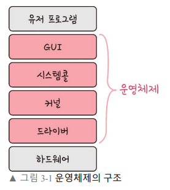
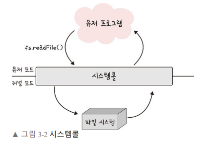

# 운영체제의 역할과 구조

## 운영체제

운영체제란 컴퓨터 시스템을 효율적으로 관리하고, 사용자가 컴퓨터를 쉽게 다룰수 있게 해주는 인터페이스이다.

## 운영체제의 역할

1. **CPU 스케줄링과 프로세스 관리 :** CPU소유권 할당과, 프록세스의 생성과 삭제, 자원 할당 및 반환을 관리한다.
2. **메모리 관리 :** 한정된 메모리를 어떤 프로세스에 얼만큼 할당해야 하는지 관리한다.
3. **디스크 파일관리 :** 디스크 파일을 어떠한 방법으로 보관할지 관리한다.
4. **I/O 디바이스 관리 :** I/O 디바이스(마우스, 키보드)와 컴퓨터 간에 데이터를 주고받는 것을 관리한다.

## 운영체제의 구조

운영체제의 구조는 아래와 같다.

운영체제를 크게 인터페이스(GUI)와 커널 2개의 부분으로 나눌 수 있다.

> **인터페이스 :** 커널에 사용자 명령어를 전달하고, 사용자에게 실행결과를 알려주는 역할을 한다.ex) CLI, GUI, NUI, OUI

> **커널 :** 프로세스 관리, 메모리 관리, 입출력 장치 관리, 파일 관리와 같은 운영체제의 핵심적인 기능을 모아놓은 곳.커널의 성능이 운영체제의 성능을 좌우한다.

## 시스템 콜

**시스템 콜**(시스템 호출)이란 운영체제가 커널에 접근 하기 위한 인터페이스이다.

유저프로그램이 I/O 요청으로 **트랩**을 발동하면 유저모드가 시스템콜을 통해 커널모드로 변환되어 실행된다.

위의 그림은 시스템콜의 동작을 그림으로 나타낸 것이다.

**유저모드**에서 파일을 열지 않고, **커널모드**로 들어가 파일을 읽고 다시 유저모드로 돌아가 그뒤에 있는 유저 프로그램의 로직을 수행한다.

이 과정을 통해 **컴퓨터 자원에 대한 직접 접근을 차단**할 수 있고 프로그램을 **다른 프로그램으로 부터 보호**할 수 있다.

 

# 컴퓨터의 요소

컴퓨터는 CPU, DMA 컨트롤러, 메모리, 타이머, 디바이스컨트롤러 등으로 이뤄져 있다.

### CPU

cpu는 산술논리연산장치, 제어장치, 레지스터로 구성되어있는 컴퓨터 장치이다.**인터럽트**에 의해 단순히 메모리에 존재하는 명령어를 해석해서 실행하는 일꾼이다.

커널이 프로그램을 메모리에 올려서 프로세스로 만들면 CPU가 이를 처리한다.

### 제어 장치

제어장치(CU)는 프로세스 조작을 지시하는 CPU의 한 부품이다.입출력 장치 간 통신을 제어하고, 명령어들을 읽고 해석하며 데이터처리를 위한 순서를 결정한다.

### 레지스터

레지스터는 CPU안에 있는 매우 빠른 임시기억 장치이다.CPU와 직접 연결되어 있어서 연산속도가 수십배에서 수백배까지 빠르다.CPU는 자체적으로 데이터를 저장할 방법이 없기에 레지스터를 거쳐 데이터를 전달한다.

### 산술논리연산장치

산술논리연산장치(ALU)는 두숫자의 산술연산과, 배타적 논리합 논리곱 같은 논리연상을 계산하는 디지털 회로이다.

## CPU의 연산 처리

- CPU에서 제어처리, 레지스터, 산술논리연산장치를 통해 연산하는 예는 다음과 같다.
  

## 인터럽트

인터럽트는 어떤 신호가 들어왔을 때 CPU를 잠시 정지시키는 것을 말한다.CPU는 인터럽트가 발생되면 하던 일을 잠시 멈추고, 우선적으로 처리해야할 일을 처리한 뒤원래 동작으로 돌아온다.

크게 **하드웨어 인터럽트**와, **소프트웨어 인터럽트**로 나뉘어 진다.

> 하드웨어 인터럽트CPU 외부로부터 인터럽트 요구신호에 의해 발생되는 인터럽트ex) I/O, Power fail(전원 공급이상), Machin check(cpu 기능오류), External(오퍼레이터나 타이머에 의해 프로그램의 중단)
>
> **소프트웨어 인터럽트**흔히 트랩이라고 한다.프로그램의 오류에 의해 생기는 인터럽트이다.ex) 프로그램 검사 인터럽트(0으로 나누는 경우, overFlow 등등), SVC 인터럽트

인터럽트가 발생되면 인터럽트 핸들러 함수가 모여있는 **인터럽트 벡터**에 등록된,해당 **인터럽트 발생 시 처리해야할 루틴** 이 실행 된다.

인터럽트에는 우선순위가 있고, 우선순위에 따라 실행된다.

> 인터럽트 우선순위
>
> Power > Machin check > External > Porgram check > SVC

### DMA 컨트롤러

DMA 컨트롤러는 I/O디바이스가 메모리에 직접접근할 수 있도록 하는 하드웨어 장치.

CPU의 부하를 막아주며, CPU의 일을 부담한다.하나의 일을 CPU와 DMA 컨트롤러가 중복 처리하지 않게끔 한다.

### 메모리

메모리는 전자회로에서 데이터나 상태 명령어 등을 기록하느 장치이다.

보통 RAM을 일컬어 메모리라고 한다.

CPU는 계산을, 메모리는 기억을 담당한다.

메모리가 크면 클수록 많은 일을 동시에 할 수 있다.
