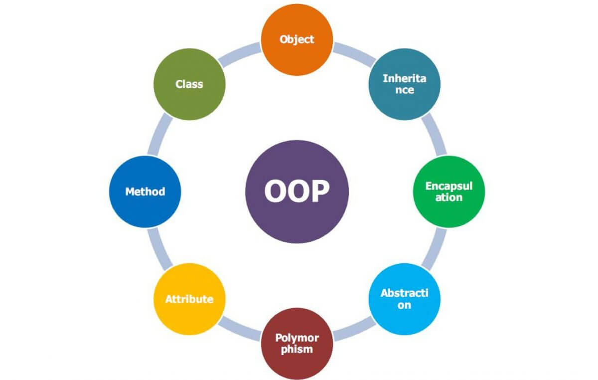

## 객체지향 프로그래밍(OOP, Object-Oriented Programming)



- 객체들의 집합으로 프로그램의 상호 작용을 표현하며 데이터를 객체로 취급하여 객체 내부에 선언된 메서드를 활용하는 방식
- 설계에 많은 시간이 소요되며 처리 속도가 다른 프로그래밍 패러다임에 비해 상대적으로 느림

```jsx
const ret = [1,2,3,4,5,11,12]
class List {
	constructor(list) {
		this.list = list
		this.mx = list.reduce((max, num) => num > max ? num : max, 0)
	}
	getMax() {
		return this.mx
	}
}
const a = new List(ret)
console.log(a.getMax()) // 12
```

---

### 특징

- 추상화(abstraction)
    - 복잡한 시스템으로부터 핵심적인 개념 또는 기능을 간추려내는 것
    - 여러 특징 중 코드로 나타낼 때 일부분의 특징만 뽑아내거나 조금 더 간추려서 나타내는 것
- 캡슐화(encapsulation)
    - 객체의 속성과 메서드를 하나로 묶고 일부를 외부에 감추어 은닉하는 것
- 상속성(inheritance)
    - 상위 클래스의 특성을 하위 클래스가 이어받아서 재사용하거나 추가, 확장하는 것
    - 코드의 재사용 측명, 계층적인 관계 생성, 유지 보수성 측면에서 중요
- 다형성(polymorphism)
    - 하나의 메서드나 클래스가 다양한 방법으로 동작하는 것
    - 오버로딩(overloading)
        - 같은 이름을 가진 메서드를 여러 개 두는 것
        - 메서드의 타입, 매개변수의 유형, 개수 등으로 여러 개를 둘 수 있으며 컴파일 중에 발생하는 ‘정적’ 다형성
        
        ```java
        class Person {
        
        	public void eat(String a) {
        		System.out.println("I eat " + a);
        	}
        
        	public void eat(String a, String b) {
        		System.out.println("I eat " + a + " and " + b);
        	}
        }
        
        public class CalculateArea {
        
        	public static void main(String[] args) {
        		Person a = new Person();
        		a.eat("apple");
        		a.eat("tomato", "phodo");
        	}
        }
        /*
        I eat apple
        I eat tomato and phodo
        */
        ```
        
    - 오버라이딩(overriding)
        - 주로 메서드 오버라이딩(method overriding)을 말하며
        - 상위 클래스로부터 상속받은 메서드를 하위 클래스가 재정의하는 것을 의미
        - 런타임 중에 발생하는 ‘동적’ 다형성
        
        ```java
        class Animal {
        	public void bark() {
        		System.out.println("mumu! mumu!");
        	}
        }
        
        class Dog extends Animal {
        	@Override
        	public void bark() {
        		System.out.println("wal!!! wal!!!");
        	}
        }
        
        public class Main {
        	public static void main(String[] args) {
        		Dog d = new Dog();
        		d.bark();
        	}
        }
        /*
        wal!!! wal!!!
        */
        ```
        

---

### 설계 원칙

- SOLID 원칙
    - S 단일 책임 원칙 (SRP, Single Responsibiility Principle)
        - 모든 클래스는 각각 하나의 책임만 가져야 한다
        - A라는 로직이 존재한다면 어떠한 클래스는 A에 관한 클래스여야 하고 이를 수정한다고 했을 때도 A와 관련된 수정이어야 함
    - O 개방-폐쇄 원칙 (OCP, Open Closed Principle)
        - 유지 보수 사항이 생긴다면 코드를 쉽게 확장할 수 있도록 하고 수정할 때는 닫혀 있어야 하는 원칙
        - 기존의 코드는 잘 변경하지 않으면서도 확장은 쉽게 할 수 있어야 함
    - L 리스코프 치환 원칙 (LSP, Liskov Substitution Principle)
        - 프로그램의 객체는 프로그램의 정확성을 깨뜨리지 않으면서 하위 타입의 인스턴스로 바꿀 수 있어야 하는 것을 의미
        - 클래스는 상속이 되기 마련이고 부모, 자식이라는 계층 관계가 만들어짐
            - 이때 부모 객체에 자식 객체를 넣어도 시스템이 문제없이 돌아가게 만드는 것을 말함
        - A 객체가 B 객체의 자식 계층일 때 A 객체를 B 객체가 와서 바꿔도 문제가 없어야 하는것
    - I 인터페이스 분리 원칙 (ISP, Interface Segregation Principle)
        - 하나의 일반적인 인터페이스보다 구체적인 여러 개의 인터페이스를 만들어야 하는 원칙
    - D 의존 역전 원칙 (DIP, Dependency Inversion Principle)
        - 자신보다 변하기 쉬운 것에 의존하던 것을 추상화된 인터페이스나 상위 클래스를 두어 변하기 쉬운 것의 변화에 영향받지 않게 하는 원칙
        - 타이어를 갈아끼울 수 있는 틀을 만들어 놓은 후 다양한 타이어를 교체할 수 있어야 함
        - 상위 계층은 하위 계층 변화에 대한 구현으로부터 독립해야 함
    

---

### 장점

- 코드가 간결해지고, 재사용성이 높다
    - 남이 만든 클래스 가져와서 사용할 수 있고 상속을 통해 확장해서도 사용 가능
- 유지보수가 쉽다
    - 캡슐화를 통해 주변 영향이 적기 때문
- 대형 프로젝트에 적합하다
    - 클래스 단위로 모듈화시켜 개발할 수 있으므로 여러 사람이 개발에 참여하는 대형 프로젝트에 적합

### 단점

- 실행 속도가 상대적으로 느리다
    - 객체를 많이 만들어 놓으니 절차지향언어에 비해 실행 속도가 상대적으로 느림
    - 절차지향언어는 초기 프로그래밍 언어로 컴퓨터의 처리 구조와 비슷해 속도가 빠름
- 설계시 많은 시간과 노력이 필요하다
    - 다양한 객체들의 상호작용을 통해 프로그램이 구성되므로 설계에 많은 시간과 노력이 필요함