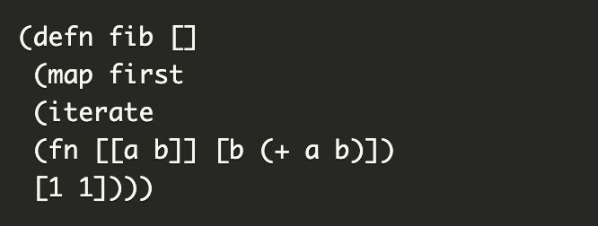
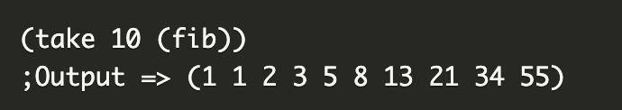

## 선언형 프로그래밍

- ‘무엇을’ 풀어내는가에 집중하는 패러다임
- “프로그램은 함수로 이루어진 것이다.” 명제

### 함수형 프로그래밍

- 선언형 패러다임의 일종

```jsx
const ret = [1,2,3,4,5,11,12]
.reduce((max, num) => num > max ? num : max, 0)
console.log(ret) // 12
```

⇒ 작은 ‘순수 함수’들을 블록처럼 쌓아 로직을 구현하고 ‘고차 함수’를 통해 재사용성을 높은 프로그래밍 패러다임

자바스크립트는 단순하고 유연한 언어, 함수가 일급 객체이기 때문에 객체지향 보다는 함수형 프로그래밍 방식이 선호

- 순수 함수
    - 출력이 입력에만 의존하는 것
    
    ```jsx
    const pure = (a, b) => {
    	return a + b
    }
    ```
    
- 고차 함수
    - 함수가 함수를 값처럼 매개변수로 받아 로직을 생성할 수 있는 것
    - 고차 함수 사용하기 위해서 해당 언어가 일급 객체라는 특징을 가져야 함
        
        > ➿ 일급 객체
        - 변수나 메서드에 함수 할당 가능
        - 함수 안에 함수를 매개변수로 담을 수 있음
        - 함수가 함수 반환가능
        - 커링, 불변성 등의 특징을 가짐
        > 

---

### 특징

- 불변성
    - 변경 가능한 상태를 최대한 제거하려고 노력한 프로그래밍 언어
    - 순수 함수를 지향하는 프로그래밍 언어
    - (장점)
    - 프로그램의 검증이 쉽다
        - 프로그램을 구성하는 모듈들이 오로지 입력 값의 영향만 받기 때문에 테스트 코드의 작성이 쉽고
        - 프로그래머가 예측하지 못하는 시점에 변경될 수 있는 내부 상태가 없어서 프로그램이 예측 가능해지기 때문
    - 최적화가 가능하다
        - 메모이제이션은 함수의 불변성이 보장되지 않으면 불가능
            - 호출할 때마다 결과 값이 달라지는 함수는 캐싱을 하는 것이 의미가 없음
        - JVM이나 CLR 같은 런타임 환경이 코드의 순서를 임의로 재배치할 수 있는 근거
            - 결과가 함수의 호출 순서와는 관계없이 오로지 함수의 입력 값에만 의존
            - 필요한 경우 런타임이 자발적으로 코드의 실행 순서를 변경하여 성능 향상
    - 동시성 프로그램을 작성하기 쉽다
        - 작성하기 힘든 이유는 여러 스레드들이 프로그램 상태를 공유하기 때문
        - 함수형 프로그래밍 언어에서는 변경 가능한 상태를 원천적으로 배제하기 때문에
            - 잠금 / 동기화 같은 골치 아픈 스레드 관련 문제에서 벗어나 핵심 로직 구현에 집중 가능
- first-class, higher-order functions
    - 함수는 일등 시민(first-class)
        - 함수란 변수에 할당 가능, 다른 함수의 인자로 전달 가능, 다른 함수의 결과 값으로 반환될 수 있는 함수
        - 고차 함수(higher-order)의 표현을 가능하게 함
            - 인수로 전달된 함수를 이용하여 만든 새로운 함수
            - 부분 적용이나 커링을 가능하게 만들어 프로그래머가 프로그램을 간결하게 작성하게 도와줌
            
            > ➿ 커링(currying)
            다중 인수(여러 인자)를 갖는 함수를 단일 인수를 갖는 함수들의 함수열로 바꾸는 것
            > 
            > 
            > 
            > 
- 지연 연산(Lazy evaluation)
    - 어떤 값이 실제로 쓰이기 전까지 그 값의 계산을 최대한 미루는 것
    - 값을 미리 계산하여 저장하지 않아서 공간 절약 가능
    - 값이 꼭 필요할 때만 계산하기 때문에 프로그램의 성능에도 긍정적 영향
    - 무한수열 표현 가능
    - 메모이제이션과 함께 사용
        - 값이 필요할 때 계산 수행 후, 다음에 해당 값이 필요할 때는 계산하지 않고  캐싱해 놓았던 값 재사용
    - 장점을 잘 표현한 예제
        - 피보나치 수열
            - 무한의 피보나치 수열을 생성하도록 구현
                
                → 값이 필요하지 않기 때문에 아무런 연산 수행하지 않고 필요한 개수를 인자로 넘겨 함수를 호출하면 계산 시작
                
                
                
                

---

### 장점

- 높은 수준의 추상화 제공
- 함수 단위의 코드 재사용이 수월
- 불변성을 지향하기 때문에 프로그램의 동작을 예측하기 쉬움

### 단점

- 순수함수를 구현하기 위해서는 코드의 가독성이 좋지 않을 수 있음
- 함수형 프로그래밍에서는 반복이 for문이 아닌 재귀를 통해 이루어지는데, 이는 무한루프에 빠지기 쉬움
    - deep copy
- 순수함수를 사용하는 것은 쉬울 수 있지만 조합하는 것은 쉽지 않다

---
 
### 객체지향과 함수형의 차이
- 함수형 프로그래밍에서는 함수 자체가 일급 객체가 되지만, 객체지향 프로그래밍에서는 클래스나 객체가 일급 객체가 됨
- 객체지향에서는 프로그램을 상호작용하는 객체들의 집합이라고 볼 수 있지만, 함수형은 상태 값을 지니지 않는 함수들의 연속으로 볼 수 있음
- 어느 하나가 우위에 있다고 말할 수 없어서 필요에 따라 합쳐 사용하기도 하고 원하는 목표에 따라 적절한 것을 잘 골라서 사용해야 함.