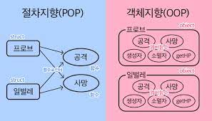
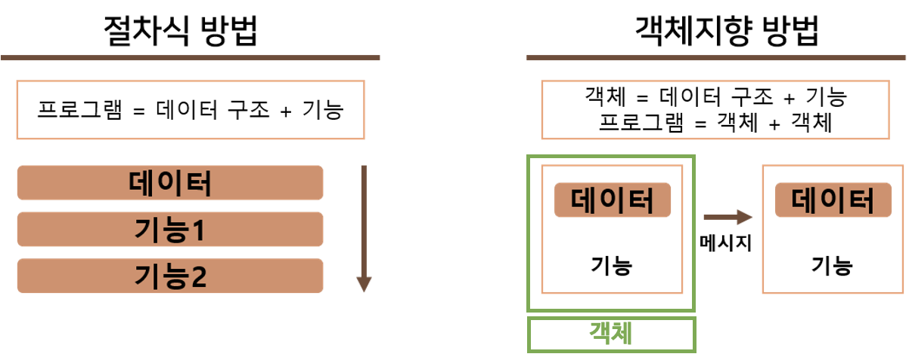

## 절차형 프로그래밍

- 로직이 수행되어야 할 연속적인 계산 과정으로 이루어져있음
- 코드의 가독성이 좋으며 실행 속도가 빠름
    - 일이 진횅되는 방식으로 그저 코드를 구현하기만 하면 되기 때문
    
    ⇒ 계산이 많은 작업 등에 쓰임
    
- 대표적 예시
    - 포트란(fortran)을 이용한 대기 과학 관련 연산 작업, 머신 러닝의 배치 작업

```jsx
const ret = [1,2,3,4,5,11,12]
let a = 0
for(let i = 0; i < ret.length; i++) {
	a = Math.max(ret[i], a)
}
console.log(a) // 12
```

---

### 장점

- 모듈 구성이 용이하며 구조적인 프로그래밍이 가능
    - 대규모 프로젝트에서 각자 자신이 맡은 부분만 프로그래밍하여 조립하는 게 가능
- 컴퓨터의 처리구조와 유사해 실행 속도가 빠름
- 코드의 재활용성이 높아짐
- 코드의 가독성이 높아짐
    - 메인 프로시저 뿐만 아니라 함수의 호출을 통해 여러 부분을 생략하여 프로그램 흐름을 쉽게 볼 수 있어서
- 

### 단점

- 모듈화하기가 어렵고 ?
    - 대부분의 구글링에서는 모듈화가 용이하다고 함
- 유지 보수성이 떨어짐
    - 각 코드가 매우 유기성이 높기 때문
- 정해진 순서대로 입력을 해야하므로 순서를 바꾸면 결과값을 보장할 수 없음
- 디버깅이 어려움

---
### 절차지향과 객체지향의 차이



- 객체지향은 데이터(변수)와 기능(메소드)을 가진 독립적인 객체를 만들고, 그 객체들의 집합을 프로그램이라고 하는 것이며 이 각각의 객체들 간의 유기적인 상호작용을 통해 로직 구성.
- 절차지향은 프로그램이 데이터 구조와 기능(함수)으로 나누어서 기능의 목록을 절차적으로 수행하는 것.